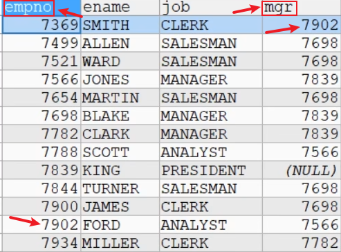

<h1 style="text-align: center;">多表查询</h1>
 
- - -

## 基本介绍

#### 问题引出

当寻需要查询的信息分布在不同的表上时，我们就需要用到多表查询

#### 多表查询

> **多表查询是指基于<span style = "color:red;font-weight:bold">两个和两个以上</span>的表查询。在实际应用中，查询单个表可能无法满足需求**

## 笛卡尔积

在不知道如何实现多表查询的情况下，按照多表查询的字面含义，尝试实现多表查询语句，看看会有什么结果

```bash
SELECT * FROM table1,table2
```

> <h4>在默认情况下：当两个表查询时，规则如下</h4>
>
> - <h4>从第一张表中，<span style = "color:red;font-weight:bold">取出一行和第二张表的每一行进行组合</span>，返回结果（含有两张表的所有列）</h4>
> - <h4><span style = "color:red;font-weight:bold">一共返回的记录数 = 第一张表行数 * 第二张表的行数</span></h4>
> - <h4>这样多表查询默认处理返回的结果，称为<span style = "color:red;font-weight:bold">笛卡尔积</span></h4>
> - <h4>解决这个多表的关键就是要<span style = "color:red;font-weight:bold">写出正确的过滤条件 where</span>, 需要程序员进行分析</h4>

## 基本使用

#### 需要调用<span style = "color:red;font-weight:bold">某张表的字段</span>，语法：<span style = "color:red;font-weight:bold">表名</span> <span style = "color:red;font-weight:bold;font-size:30px">.</span> <span style = "color:red;font-weight:bold">字段</span>

#### 整体思路：由易到难，逐步拆分，先写一个简单的 sql，然后加入过滤条件

#### 注意点 ⚠️

> - <h4>多表查询的条件<span style = "color:red;font-weight:bold">不能少于表的个数-1</span>, <span style = "color:red;font-weight:bold">否则会出现笛卡尔集</span></h4>
> - <h4>当<span style = "color:red;font-weight:bold">不同表的字段名同名</span>时，需要明确字段属于哪一张表（语法：<span style = "color:red;font-weight:bold">表名</span> <span style = "color:red;font-weight:bold;font-size:30px">.</span> <span style = "color:red;font-weight:bold">字段</span>），否则会出现语法错误</h4>

#### 案例：显示部门号为 10 的部门名、员工名，工资

#### 思路分析

- emp 表：雇员名、雇员工资
- dept 表：部门的名字

#### 1. 首先我们可以显示雇员名、雇员工资及所在的部门名字

```bash
SELECT ename,sal,dname,emp.deptno
FROM emp, dept
WHERE emp.deptno = dept.deptno
```

#### 2. 加上过滤条件，只显示部门号为 10 的部门名

```bash
SELECT ename,sal,dname,emp.deptno
FROM emp, dept
WHERE emp.deptno = dept.deptno AND emp.deptno = 10
```

## 自连接

#### 定义：自连接是指在同一张表的连接查询，将<span style = "color:red;font-weight:bold">同一张表看作两张表</span>，需要明确字段属于哪一张表（语法：<span style = "color:red;font-weight:bold">表名</span> <span style = "color:red;font-weight:bold;font-size:30px">.</span> <span style = "color:red;font-weight:bold">字段</span>），否则会出现语法错误

#### 注意点 ⚠️

> - <h4>将<span style = "color:red;font-weight:bold">同一张表看作两张表</span>，需要<span style = "color:red;font-weight:bold">起别名</span>，避免冲突导致语法报错</h4>
> - <h4>起别名语法：FROM <span style = "color:red;font-weight:bold">原表名 别名1，原表名 别名2...</span></h4>
> - <h4><span style = "color:red;font-weight:bold">列名</span>不明确，需要<span style = "color:red;font-weight:bold">起别名</span></h4>

#### 案例：显示公司员工和上级的的名字



#### 思路分析

- 员工名字 在 emp, 上级的名字在 emp
- 员工和上级是通过 emp 表的 mgr 列关联

```bash
SELECT worker.ename AS '职员名', boss.ename AS '上级名'
FROM emp worker, emp boss # 起别名
WHERE worker.mgr = boss.empno; # 关系式
```

## 子查询

### 基本介绍

> #### 子查询是指嵌入在其它 sql 语句中的 select 语句，也叫<span style = "color:red;font-weight:bold">嵌套查询</span>

### 单行子查询

> #### 单行子查询是指<span style = "color:red;font-weight:bold">只返回一行数据</span>的子查询语句

#### 案例：如何显示与 SMITH 同一部门的所有员工？

#### （1）首先需要知道 SMITH 的部门编号

```bash
SELECT deptno
FROM emp
WHERE ename = 'SMITH'
```

#### （2）然后通过部门编号查询

```bash
SELECT *
FROM emp
WHERE deptno = (
    SELECT deptno
    FROM emp
    WHERE ename = 'SMITH'
);
```

### 多行子查询

> #### 多行子查询指<span style = "color:red;font-weight:bold">返回多行数据</span>的子查询 使用<span style = "color:red;font-weight:bold">关键字 in</span>

#### 案例：如何查询和 10 号部门中工作岗位（可以有多个）相同的雇员的名字、岗位、工资、部门号，但是不含 10 号部门的雇员

#### （1）首先查询 10 号部门有哪些工作岗位

```bash
SELECT DISTINCT job
FROM emp
WHERE deptno = 10;
```

#### （2）使用<span style = "color:red;font-weight:bold">关键字 in</span>，利用子查询结果，同时增加过滤条件

```bash
SELECT ename, job, sal, deptno
FROM emp
WHERE job IN (
    SELECT DISTINCT job
    FROM emp
    WHERE deptno = 10
) AND deptno <> 10;
```
