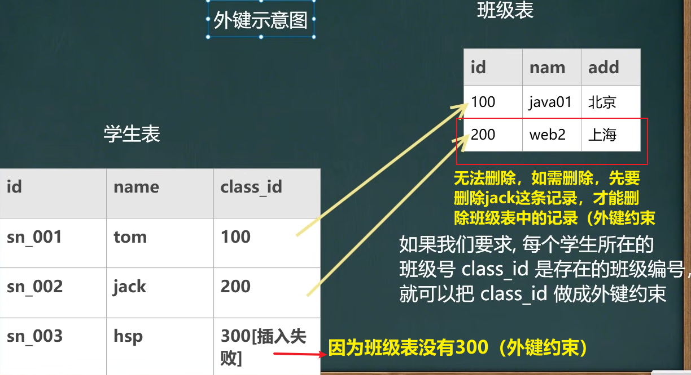

<h1 style="text-align: center;">MySQL 约束</h1>
 
- - -

## PRIMARY KEY

### 基本介绍

#### 用于表行的数据的<span style = "color:red;font-weight:bold">唯一标识</span>，当定义主键约束后，<span style = "color:red;font-weight:bold">该列不能重复</span>

### 使用细节

#### 1. primary key <span style = "color:red;font-weight:bold">不能重复且不能为 null</span>

> <h4>语法：字段名 字段类型 <span style = "color:red;font-weight:bold">primary key</span></h4>

#### 2. 一张表<span style = "color:red;font-weight:bold">最多只能有一个主键</span>，<span style = "color:red;font-weight:bold">但可以是复合主键</span>

#### 3. 主键的指定方式有两种

> - <h4>直接在字段名后指定：字段名 primary key</h4>
> - <h4>在表定义最后写 primary key(列名);</h4>

#### 4. 使用 desc 表名，可以看到 primary key 的情况。

#### 5. 温馨提示：在实际开发中，每个表往往会设计一个主键。

```bash
-- id  name  email
CREATE TABLE t17
(
    id INT PRIMARY KEY, -- 表示 id 列是主键
    `name` VARCHAR(32),
    email VARCHAR(32)
);

-- 主键列的值是不可重复
INSERT INTO t17
VALUES(1, 'jack', 'jack@sohu.com');

INSERT INTO t17
VALUES(2, 'tom', 'tom@sohu.com');

INSERT INTO t17
VALUES(1, 'hsp', 'hsp@sohu.com'); -- 违背了主键（id相同）
```

### 复合主键

#### 使用符合主键时，只有当符合主键值<span style = "color:red;font-weight:bold">全部相同</span>才会违反规则

```bash
CREATE TABLE t18
(
    id INT,
    `name` VARCHAR(32),
    email VARCHAR(32),
    PRIMARY KEY (id, `name`) -- 这里是复合主键
);

INSERT INTO t18
VALUES(1, 'tom', 'tom@sohu.com');

INSERT INTO t18
VALUES(1, 'jack', 'jack@sohu.com');

INSERT INTO t18
VALUES(1, 'tom', 'xx@sohu.com'); -- 这里就违反了复合主键（id、name相同）

SELECT * FROM t18;
```

## NOT NULL

#### 如果指定了字段非空，即<span style = "color:red;font-weight:bold">字段值非空</span>，则在添加数据时必须给这个字段添加数据

> #### 语法：字段名 字段类型 <span style = "color:red;font-weight:bold">NOT NULL</span>

```bash
CREATE TABLE mytable
(
    id INT NOT NULL,
    name VARCHAR(32)
);
```

## UNIQUE

#### 当定义了唯一约束后，<span style = "color:red;font-weight:bold">该列值是不能重复的</span>

> #### 语法：字段名 字段类型 <span style = "color:red;font-weight:bold">UNIQUE</span>

#### 使用细节

#### （1）如果<span style = "color:red;font-weight:bold">没有指定 NOT NULL</span>，则 UNIQUE 字段<span style = "color:red;font-weight:bold">可以有多个 NULL</span>

#### （2）一张表<span style = "color:red;font-weight:bold">可以有多个 UNIQUE 字段</span>

## 外键约束

### 基本介绍



#### 外键约束

> #### 用于定义主表和从表之间的关系：外键约束要定义在从表上，<span style = "color:red;font-weight:bold">主表</span>则<span style = "color:red;font-weight:bold">必须有主键约束或是 unique 约束</span>。当定义外键约束后，要要求外键列数据必须在主表的主键列存在或是为 null
>
> #### <span style = "color:red;font-weight:bold">主表</span>：班级表（约束方）
>
> #### <span style = "color:red;font-weight:bold">从表</span>：学生表（被约束方）

### 基本语法

> #### 语法：<span style = "color:red;font-weight:bold">FOREIGN KEY</span> （本表字段名）<span style = "color:red;font-weight:bold"> REFFERENCES</span>

```bash
# 创建 主表 my_class
CREATE TABLE my_class (
  id INT PRIMARY KEY, # 班级编号
  `name` VARCHAR(32) NOT NULL DEFAULT ''
);

# 创建 从表 my_stu
CREATE TABLE my_stu (
  id INT PRIMARY KEY, # 学生编号
  `name` VARCHAR(32) NOT NULL DEFAULT '',
  class_id INT, -- 学生所在班级的编号
  FOREIGN KEY (class_id) REFERENCES my_class(id)  # 指定外键关系
);
```

### 使用细节

> #### 1. 外键指向的表的字段，要么是 <span style = "color:red;font-weight:bold">primary key 或者是 unique</span>
>
> #### 2. <span style = "color:red;font-weight:bold">表的类型必须是 innodb</span>，这样的表才支持外键
>
> #### 3. <span style = "color:red;font-weight:bold">外键</span>字段的类型跟<span style = "color:red;font-weight:bold">主键</span>字段的<span style = "color:red;font-weight:bold">类型一致</span>（长度可以不同）
>
> #### 4. ⭐<span style = "color:red;font-weight:bold">外键字段的值，必须在主键字段中出现过，或者为 null【前提是外键字段允许 null】</span>⭐
>
> #### 5. 一旦建立外键的关系，<span style = "color:red;font-weight:bold">数据不能随意删除</span>

## CHECK

### 基本介绍

> #### <span style = "color:red;font-weight:bold">用于强制执行数据必须满足的条件</span>，假定在 sal 列上定义了 check 约束，并要求 sal 值在 1000 ~ 2000 之间，如果不在 1000 ~ 2000 之间就会提示错误

### 基本语法

> #### 列名 类型 <span style = "color:red;font-weight:bold"> CHECK</span> （条件）

```bash
CREATE TABLE t23 (
  id INT PRIMARY KEY,
  `name` VARCHAR(32),
  sex VARCHAR(6) CHECK (sex IN('man','woman')),
  sal DOUBLE CHECK (sal > 1000 AND sal < 2000)
);
```

### 使用细节

> #### oracle 和 sql server 都支持 check，但是 <span style = "color:red;font-weight:bold">mysql5.7</span> 目前还不支持 check，只做语法校验，但<span style = "color:red;font-weight:bold">不会生效</span>

## 约束建表练习


```bash
CREATE DATABASE shop_db;

-- 现有一个商店的数据库 shop_db，记录客户及其购物情况，包含以下三个表：
-- 商品 goods (商品号 goods_id, 商品名 goods_name, 单价 unitprice, 商品类别 category, 供应商 provider);
-- 客户 customer (客户号 customer_id, 姓名 name, 地址 address, 邮箱 email 性别 sex, 身份证 card_ID);
-- 购买 purchase (购买订单号 order_id, 客户号 customer_id, 商品号 goods_id, 购买数量 nums);

-- 1 建表，在定义时要求声明 [进行合理设计]:
-- (1) 每个表的主外键;
-- (2) 客户的姓名不能为NULL值;
-- (3) 邮箱不能重复;
-- (4) 客户的性别[男|女] check 枚举..
-- (5) 单价 unitprice 在 1.0 - 9999.99 之间 check..

-- 商品 goods
CREATE TABLE goods (
    goods_id INT PRIMARY KEY,
    goods_name VARCHAR(64) NOT NULL DEFAULT "",
    unitprice DECIMAL(10,2) NOT NULL DEFAULT 0 CHECK (unitprice >= 1.0 AND unitprice <= 9999.99),
    category INT NOT NULL DEFAULT 0,
    provider VARCHAR(64) NOT NULL DEFAULT ""
);

-- 2. 客户表（customer）定义
CREATE TABLE customer (
    customer_id CHAR(8) PRIMARY KEY,          -- 客户编号
    name VARCHAR(64) NOT NULL DEFAULT '',     -- 姓名
    address VARCHAR(64) NOT NULL DEFAULT '',  -- 地址
    email VARCHAR(64) UNIQUE NOT NULL,        -- 电邮（唯一且不能为空）
    sex ENUM('男', '女') NOT NULL,            -- 性别（枚举：男，女）
    card_id CHAR(18)                         -- 身份证
);

-- 3. 购买表（purchase）定义
CREATE TABLE purchase (
    order_id INT UNSIGNED PRIMARY KEY,        -- 订单编号
    customer_id CHAR(8) NOT NULL,             -- 客户编号（外键）
    goods_id INT NOT NULL DEFAULT 0,          -- 商品编号（外键）
    nums INT NOT NULL DEFAULT 0,              -- 购买数量
    FOREIGN KEY (customer_id) REFERENCES customer(customer_id), -- 关联客户表
    FOREIGN KEY (goods_id) REFERENCES goods(goods_id)           -- 关联商品表
);
```

## 自增长

### 基本介绍

#### 在某张表中，有一个字段（id 列（整数）），我们希望在添加记录的时候该列从 1 开始，<span style = "color:red;font-weight:bold">自动增长</span>

### 基本语法

> #### 字段名 整型 PRIMARY KEY <span style = "color:red;font-weight:bold">AUTO_INCREMENT</span>

#### 添加方式

> #### insert into xxx (字段 1, 字段 2.....) values(null, '值 1', '值 2....)
>
> #### insert into xxx (字段 2....) values('值 1', '值 2'....)
>
> #### insert into xxx values(null, '值 1', ....)

```bash
CREATE TABLE users (
    id INT AUTO_INCREMENT PRIMARY KEY,
    name VARCHAR(50),
    email VARCHAR(100)
);

INSERT INTO users (name, email) VALUES ('Alice', 'alice@example.com');
```

### 使用细节

> #### 1. 一般来说，自增键是<span style = "color:red;font-weight:bold">和 primary key 配合使用的</span>

> #### 2. 自增键也可以<span style = "color:red;font-weight:bold">单独使用（但是需要配合一个 unique）</span>

> #### 3. 自增键修饰的字段为<span style = "color:red;font-weight:bold">整型</span>的（虽然小数也可以，但是非常非常少这样使用）。

> #### 4. 自增键值<span style = "color:red;font-weight:bold">默认从 1 开始</span>，你也可以通过如下命令修改 <span style = "color:red;font-weight:bold">alter table 表名 auto_increment = 新的开始值</span>

> #### 5. 如果你添加数据时，<span style = "color:red;font-weight:bold">给自增键字段（列）指定的有值，则以指定的值为准</span>，如果指定了自增键，一般来说，就按照自增键的规则来添加数据。

### 修改字段为自增长

#### 注意：自增长的字段<span style = "color:red;font-weight:bold">首先应该是主键</span>

```bash
ALTER TABLE table01 MODIFY COLUMN id INT AUTO_INCREMENT
```
