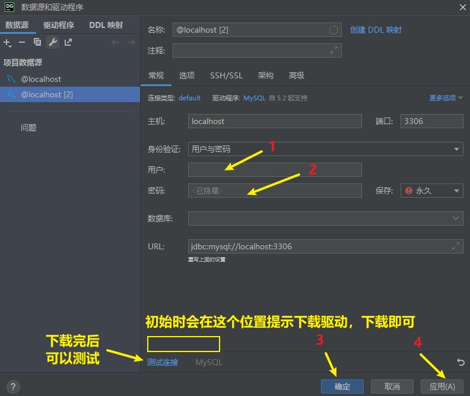

<h1 style="text-align: center;">DataGrip 安装</h1>
 
- - -

## 下载

#### 点击下方连接下载 DataGrip-2023.2.3

#### https://download.jetbrains.com/datagrip/datagrip-2023.2.3.exe

## 创建项目

## 连接数据库

 

 

 

## ⭐ 打开查询窗口

> #### 快捷键：Ctrl + Shift + Q

 

## 设置

> #### 隶属 JetBrains 公司旗下产品，可参考其他产品的设置，大部分是互通的
