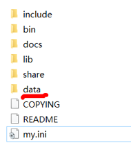

<h1 style="text-align: center;">MySQL 5.7 安装</h1>
 
- - -
## 1. 点击连接开始下载
https://dev.mysql.com/get/Downloads/MySQL-5.7/mysql-5.7.19-winx64.zip

> 如果安装过 Mysql 过程中，出错了或者想重新再来一把
>
> sc delete mysql 【删除已经安装好的 mysql 服务 提示：慎重 ❗❗❗】

## 2. 安装

#### 1. 下载后会得到 zip 文件

#### 2. 解压的路径最好不要有中文和空格

#### 3. 这里我解压到 D:\javatool\mysql-5.7.19-winx64 目录下 【根据自己的情况来指定目录,尽量选择空间大的盘】

#### 4. 添加环境变量 : 电脑-属性-高级系统设置-环境变量，在 Path 环境变量增加 mysql 的安装目录\bin 目录


#### 5. 在 D:\javatool\mysql-5.7.19-winx64 目录下下创建 <span style = "color:red;font-weight:bold">my.ini</span> 文件, 需要我们自己创建

#### 文件内容如下

```ini
[client]
port=3306
default-character-set=utf8
[mysqld]
# 设置为自己MYSQL的安装目录
basedir=D:\javatool\mysql-5.7.19-winx64\
# 设置为MYSQL的数据目录
datadir=D:\javatool\mysql-5.7.19-winx64\data\
port=3306
character_set_server=utf8
#跳过安全检查
skip-grant-tables
```

#### 以下路径需要<span style = "color:red;font-weight:bold">改成自己的路径</span>

```ini
# 设置为自己MYSQL的安装目录
basedir=D:\javatool\mysql-5.7.19-winx64\
# 设置为MYSQL的数据目录
datadir=D:\javatool\mysql-5.7.19-winx64\data\
```

## 管理员身份打开 cmd

#### 1. win + r 打开运行窗口，输入 cmd ，点击确定

#### 2. 点击下拉符号，<span style = "color:red;font-weight:bold">按住 ctrl 键</span>点击命令提示符


#### 6. 使用<span style = "color:red;font-weight:bold">管理员</span>身份打开 cmd , 并切换到 D:\javatool\mysql-5.7.19-winx64\bin 目录下（<span style = "color:red;font-weight:bold">改成自己的路径</span>）, 执行<span style = "color:blue;font-weight:bold">mysqld -install</span>

#### 7. 初始化数据库: <span style = "color:blue;font-weight:bold">mysqld --initialize-insecure --user=mysql</span>，如果执行成功，会生成 data 目录



### 安装报错问题 ⚠️


<h3>安装如下软件即可解决</h3>

#### https://pan.baidu.com/s/1QapoWm155hqXGmavFN2wYA?pwd=dfzf 提取码: dfzf


## 3. 启动与关闭服务

#### <span style = "color:red;font-weight:bold">启动</span> mysql 服务:

```bash
net start mysql
```

#### <span style = "color:red;font-weight:bold">停止</span> mysql 服务指令

```bash
net stop mysql
```

## 4. 进入 MySQL

```bash
mysql -u root -p
```

## 5. 修改密码

### 第一步

```bash
use mysql;
```

#### 注意点：需要<span style = "color:red;font-weight:bold">加上分号</span>，按回车执行指令

### 第二步

#### password 后面括号的字符串就是密码，这里示例是 123

```bash
update user set authentication_string=password('123') where user='root' and Host='localhost';
```

#### 注意点：需要<span style = "color:red;font-weight:bold">加上分号</span>，按回车执行指令

### 第三步

#### 执行如下命令<span style = "color:red;font-weight:bold">刷新权限</span>

```bash
flush privileges;
```

#### 注意点：需要<span style = "color:red;font-weight:bold">加上分号</span>，按回车执行指令

### 第四步

#### <span style = "color:red;font-weight:bold">修改</span>原先的 <span style = "color:red;font-weight:bold">my.ini</span> 配置文件，加上 <span style = "color:red;font-weight:bold">#</span> 号，注释最后一行

```bash
# skip-grant-tables
```

### 第五步

#### 退出 MySQL

```bash
quit
```

## 6. 进入 MySQL

#### 以<span style = "color:red;font-weight:bold">管理员</span>身份打开 cmd

### 启动服务

```bash
net start mysql
```

### 用户登录

```bash
mysql -u root -p(密码)
```

> #### -u ：后面跟用户名
>
> #### -p ：后面跟密码，<span style = "color:red;font-weight:bold">不要有空格</span>

## 7. 连接 MySQL 指令


#### 使用如下指令连接后，可以在<span style = "color:red;font-weight:bold">普通 cmd 窗口下操作 Mysql</span>

```bash
mysql -h 主机名（可填localhost） -P 端口（默认是3306） -u 用户名 -p 密码
```
