# Vitepress 搭建教程

## 版本说明

- ## node：v18.16.0
- ## npm：9.5.1
- ## pnpm：8.6.12

## 基本介绍

## 学习资源

## https://vitepress.yiov.top/

## 启动项目

## 由于再 Github 上拉取的代码是是忽略了一些文件的，拉去项目代码到本地后执行==pnpm install==命令，安装==node_modules==，之后再启动项目即可

## 文件结构（初始化）

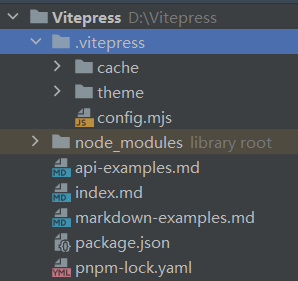

## 模块分类

- ## [首页配置](#首页配置)

  - ## 标题内容
  - ## social link
  - ## footer
  - ## 图标
  - ## 主题
  - ## 左上角导航栏
  - ## 网站标签页

- ## [导航栏](#导航栏)
  - ## 多个导航栏
  - ## 导航栏分类
- ## [侧边栏](#侧边栏)
  - ## 内容分类
  - ## 折叠功能
  - ## [自动生成侧边栏](#5.自动生成侧边栏)
  - ## 两栏式布局
- ## [布局模式](#布局模式)
- ## [文章页配置](#文章页配置)

## 优化部分

- ## 自定义主题
- ## markdown 扩展
- ## markdown 显示优化
  - ## 代码块颜色（分亮色和暗色模式）
  - ## 显示行号
- ## 搜索功能
- ## 代码块分组：实现不同语言代码的切换，方便阅读(聪哥网站有)
- ## 提供在线下载功能
- ## 主页优化：烟花效果

---

# 首页配置

## 1. 左上角导航栏

- ## 名称：在 config.mjs 文件中的 themeConfig 部分的开头加上`siteTitle: '名称'`
- ## logo：还是在开头加上`logo:'文件路径'`

## 注意：需要在==根目录下创建 public 文件夹存放图片==，文件路径只需要写图片名称+文件后缀名，==会自动链接==到 public 文件夹中的内容

## 2. 页脚版权

## 在 `config.mjs` 文件中的 themeConfig 部分的最后加上

```javascript
footer: {
    message: '个人知识文档网站',
    copyright: 'Copyright © 2025 jackson凌 | All Rights Reserved.',
},
```

## 3. 左上角导航栏标题

## 在`config.mjs` 文件中的 themeConfig 开头添加如下代码

```java
siteTitle: 'jackson凌', // 左上角导航栏名称
```

## 4. 图标

## （1）网页标签页图标

## 在`config.mjs` 文件中的开头添加如下代码，`href`的内容换成图标路径即可（注意：图片保存在 public 文件夹下，会自动在这个文件中找文件，==确保 public 文件夹在项目的跟目录下==，即==路由为文件的名称==）

```javascript
head: [["link", {rel: "icon", href: "/星球.svg"}]], // 网页标签页的图标
```

## 特别注意！！！

## 如果==设置了 base==，图片路径需要==先链接 base==才可以显示

```js
// 设置base
base: "/vitepress/", // 路由为 GitHub 仓库名称

/* 特别注意：如果设置了base，需要先链接base（base的路径名称），再链接图片 */
head: [['link', {rel: 'icon', href: "/vitepress/标签logo.png"}]], // 网页标签页的图标
```

## （2）左上角导航栏图标

## 在`config.mjs` 文件中的 themeConfig 开头添加如下代码

```javascript
logo: '/星球.png', // 左上角导航栏图标
```

## （3）主页图标

## 在`index.md`文件中添加 image 属性，通过指定图片实现亮色和暗色主题下显示不同的图片

```javascript
hero:
  name: "博客@jackson凌"
  text: "知识文档站"
  tagline: "构建知识体系，成就Java后端工程师之路"
  image:
    light: /浙大.svg
    dark: /星球.png
```

## 5. 设置主页搜索框

## 在`config.mjs` 文件中的 themeConfig 最后添加如下代码

```javascript
// 设置搜索框的样式
search: {
provider: "local",
options: {
  translations: {
    button: {
      buttonText: "搜索文档",
      buttonAriaLabel: "搜索文档",
    },
    modal: {
      noResultsText: "无法找到相关结果",
      resetButtonTitle: "清除查询条件",
      footer: {
        selectText: "选择",
        navigateText: "切换",
      },
    },
  },
},
},
```

---

# 导航栏

## 1. 所属文件：config.mjs

## 2. 所属部分：nav

## 3. 编写思路

- ## nav：==最外层==传的是==列表==结构
- ## 结构如下（==一个导航栏==是一个==字典==）
  - ## text：导航栏==内容==
  - ## link：导航栏的==链接==（单导航栏结构）
    - ## 如果是`link : ' / '`代表链接到首页，并且导航栏内容会变蓝色，可以在没有内容的时候时使用
  - ## items：是一个==列表==，里面仍然可以==传入多个字典==（多导航栏结构）
- ## 多个导航栏的结构
  - ## 方式一：==一个列表==里有==多个字典==元素
  - ## 方式二：在==一个字典中==传入 items 列表，列表中依然存放字典
- ## 带分割线的导航栏
  - ## 分割线上：字典中只传入 text 作为标识，不传入 items
  - ## 分割线下：在字典中只传入 items 构建多导航栏
  - ## 注意：如果需要在分组的内容中显示标签，仍然可以传入 text 标签

## 代码示例

```javascript
nav: [

    // 第一个导航栏
    {text: 'Home', link: '/'},

    // 第二个导航栏
    {text: 'Examples', link: '/markdown-examples'},

    // 第三个导航栏
    {
        text: 'Java', // 作为导航栏标识

        items: // 传入 items 作为导航栏内容
        [
            // 传入第一个字典
            {text: '基础语法', link: '/'},

            // 传入第二个字典
            {
                text: 'OOP',  // 作为分组的 text 标签说明

                // 字典中只传入 items 实现分割线
                items:
                [
                    {text: '面向对象基础', link: '/'},
                    {text: '面向对象中级', link: '/'},
                    {text: '面向对象高级', link: '/'}
                ]
            },
        ]
    }

    // 第...个导航栏
],
```

## 总结

- ## 一个导航栏就是一个字典（text + link）
- ## 如果需要==多个导航栏==就添加属性 items，在 items 列表中传入多个字典
- ## 如果需要==分割线==
  - ## 1. 一个导航栏标题下的有多个子导航栏
    - ## 不写 text 属性，添加 items 列表，在列表中传入多个字典
  - ## 2. 子导航栏需要分类描述信息
    - ## 在一的基础上添加 text 属性

---

# 侧边栏

## 1. 所属文件：config.mjs

## 2. 所属部分：sidbar

## 3. 编写思路

- ## sidebar：==最外层==传的是==字典==结构
- ## 不同导航栏对应不同的侧边栏
  - ## 结构：传入多个==列表==
  - ## 点击不同导航栏的侧边栏显示
    - ## 需要在每一个文件前设置路由
    - ## 路由的含义：点击导航栏后会把导航栏中的 link 在侧边栏中匹配，找到文章对应的侧边栏组别，==路由表示在该分类侧边栏中显示该路由下的所有文章内容==（和侧边栏中点击文章跳转到对应的路由有关）
- ## 导航栏中==实现内容分类==：传入字典，传入 items 属性，编写规则和导航栏一致
- ## 侧边栏内容的==折叠功能==
  - ## 在每个侧边栏内容的分类中（==字典中 text 属性下方的位置==）添加两个属性
  - ## `collapsible: true`：表示开启折叠功能
  - ## `collapsed: false`：表示默认状态下是展开的

## 侧边栏代码示例

```javascript
sidebar:
// 会根据导航栏中链接的文章路由来匹配不同的侧边栏，根据侧边栏前的路由来显示该路由下的文章内容
{
    '/docs/Java/第一阶段':
        [
            {
                text: '基础语法',
                collapsible: true,   // 允许折叠
                collapsed: false,    // 一开始就展开
                items:
                    [
                        {
                            text: '1.基本内容介绍', link: '/docs/Java/第一阶段/基本语法/1.基本内容介绍.md'
                        },
                        {
                            text: '2.转移符', link: '/docs/Java/第一阶段/基本语法/2.转义符.md'
                        }
                    ],
            },
            {
                text: '面向对象基础',
                items:
                    [
                        {
                            text: '27.类与对象', link: 'docs/Java/第一阶段/面向对象基础/27.类与对象.md',
                        }
                    ]
            },
            {
                text: '面向对象中级',
                items:
                    [
                        {
                            text: '37.包', link: 'docs/Java/第一阶段/面向对象中级/37.包.md',
                        }
                    ]
            },
            {
                text:'第一阶段项目',
                items:
                [
                    {
                        text: '零钱通项目',link: '/',
                    },
                    {
                        text: '房屋出租系统',link: '/',
                    }
                ]
            }

        ],
    '/docs/Java/第二阶段':
        [],
    '/docs/Java/第三阶段':
        [],
}
```

## 4. 侧边栏效果图

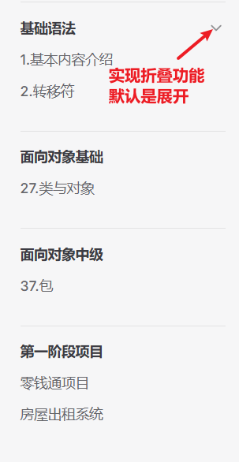

## 折叠功能代码示例

```javascript
{
    text: '基础语法',
    collapsible: true,   // 允许折叠
    collapsed: false,    // 一开始就展开
    items:
        [
            {
                text: '1.基本内容介绍', link: '/docs/Java/第一阶段/基本语法/1.基本内容介绍.md'
            },
            {
                text: '2.转移符', link: '/docs/Java/第一阶段/基本语法/2.转义符.md'
            }
        ],
}
```

## 5. 自动生成侧边栏

## 脚本源码如下（只对文件名有序号的生效，生成的侧边栏会按照文件名的序号进行排序）

```javascript
import path from "node:path";
import fs from "node:fs";

// 文件根目录
const DIR_PATH = path.resolve();
// 白名单，过滤掉不是文章的文件和文件夹0
const WHITE_LIST = [
  "index.md",
  ".vitepress",
  "node_modules",
  ".idea",
  "assets",
];

// 判断是否是文件夹
const isDirectory = (filePath) => fs.lstatSync(filePath).isDirectory();

// 取差值
const intersections = (arr1, arr2) =>
  arr1.filter((item) => !arr2.includes(item));

// 自然排序函数，按照文件名中的数字进行排序
const naturalSort = (a, b) => {
  const aNum = parseInt(a.match(/\d+/), 10);
  const bNum = parseInt(b.match(/\d+/), 10);
  return aNum - bNum;
};

// 把方法导出直接使用
function getList(params, path1, pathname, isRoot = false) {
  // 存放结果
  const res = [];
  // 对文件进行自然排序
  params.sort(naturalSort);

  // 开始遍历params
  for (let file of params) {
    // 拼接目录
    const dir = path.join(path1, file);
    // 判断是否是文件夹
    const isDir = isDirectory(dir);
    if (isDir) {
      // 如果是文件夹, 读取之后作为下一次递归参数
      const files = fs.readdirSync(dir);
      // 排除白名单中的文件夹
      const subItems = intersections(files, WHITE_LIST);
      res.push({
        text: file,
        collapsible: isRoot, // 只有根目录设置折叠功能
        collapsed: false, // 默认全部内容展开
        items: getList(subItems, dir, `${pathname}/${file}`),
      });
    } else {
      // 获取文件名，并去除扩展名
      const name = path.basename(file, ".md");
      // 排除非 .md 文件
      const suffix = path.extname(file);
      if (suffix !== ".md") {
        continue;
      }
      res.push({
        text: name, // 不显示 .md 后缀
        link: `${pathname}/${name}`, // 保留文件名作为链接
      });
    }
  }
  return res;
}

export const set_sidebar = (pathname) => {
  // 获取pathname的路径
  const dirPath = path.join(DIR_PATH, pathname);
  // 读取pathname下的所有文件或者文件夹
  const files = fs.readdirSync(dirPath);
  // 过滤掉白名单中的文件和文件夹
  const items = intersections(files, WHITE_LIST);
  // 使用 getList 函数生成侧边栏，根目录设置为折叠
  return getList(items, dirPath, pathname, true); // 设置根目录为可折叠
};
```

## 注意：路由中所有的 markdown 文件都是以数字开头的，在生成侧边栏时==会自动排序==，实现了根据文章目录结构来实现侧边栏内容分类，同时添加了 ==折叠功能==，==根目录名称将作为 title 标签==

## 使用方法

- ## 在`.vitepress`根目录创建文件`gen_sidebar.js`
- ## 粘贴脚本源码进去
- ## 在`config.mjs`文件中的最开头导入
- ## 在 sidebar 中调用函数:`'路由'：set_sidebar('路由')`

## 导入函数

```javascript
import { set_sidebar } from "./gen_sidebar.js"; // 导入自动生成侧边栏脚本
```

## 在 sidebar 中调用函数

```javascript
'/docs/Java/第一阶段': set_sidebar('/docs/Java/第一阶段'),
```

## 路由说明：表示显示当前路由下的`.md`文件

## 示例代码

```javascript
sidebar:
// 会根据导航栏中链接的文章路由来匹配不同的侧边栏，根据侧边栏前的路由来显示该路由下的文章内容
{
    '/docs/Java/第一阶段': set_sidebar('/docs/Java/第一阶段'),

},
```

## 效果如下

## 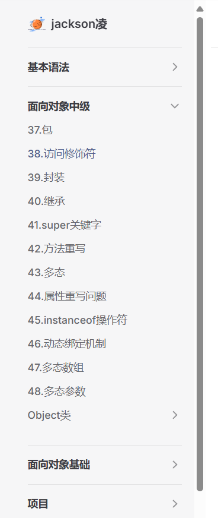

## 补充内容

## （1）直接根据目录下的文章顺序生成侧边栏

```js
import path from "node:path";
import fs from "node:fs";

// 文件根目录
const DIR_PATH = path.resolve();
// 白名单，过滤掉不是文章的文件和文件夹
const WHITE_LIST = [
  "index.md",
  ".vitepress",
  "node_modules",
  ".idea",
  "assets",
];

// 判断是否是文件夹
const isDirectory = (filePath) => fs.lstatSync(filePath).isDirectory();

// 取差值
const intersections = (arr1, arr2) =>
  arr1.filter((item) => !arr2.includes(item));

// 把方法导出直接使用
function getList(params, path1, pathname, isRoot = false) {
  // 存放结果
  const res = [];

  // 开始遍历params
  for (let file of params) {
    // 拼接目录
    const dir = path.join(path1, file);
    // 判断是否是文件夹
    const isDir = isDirectory(dir);
    if (isDir) {
      // 如果是文件夹, 读取之后作为下一次递归参数
      const files = fs.readdirSync(dir);
      // 排除白名单中的文件夹
      const subItems = intersections(files, WHITE_LIST);
      res.push({
        text: file,
        collapsible: isRoot, // 只有根目录设置折叠功能
        collapsed: false, // 默认全部内容展开
        items: getList(subItems, dir, `${pathname}/${file}`),
      });
    } else {
      // 获取文件名，并去除扩展名
      const name = path.basename(file, ".md");
      // 排除非 .md 文件
      const suffix = path.extname(file);
      if (suffix !== ".md") {
        continue;
      }
      res.push({
        text: name, // 不显示 .md 后缀
        link: `${pathname}/${name}`, // 保留文件名作为链接
      });
    }
  }
  return res;
}

export const set_sidebar = (pathname) => {
  // 获取pathname的路径
  const dirPath = path.join(DIR_PATH, pathname);
  // 读取pathname下的所有文件或者文件夹
  const files = fs.readdirSync(dirPath);
  // 过滤掉白名单中的文件和文件夹
  const items = intersections(files, WHITE_LIST);
  // 使用 getList 函数生成侧边栏，根目录设置为折叠
  return getList(items, dirPath, pathname, true); // 设置根目录为可折叠
};
```

## 如果在自动生成侧边栏的基础上还想单独添加文章，点击文章后不会导致侧边栏的消失，可以在该新文章链接下也显示相同的侧边栏，代码如下

```js
sidebar:
{
    'docs/算法/代码随想录/训练营':
    [

        {text: '随想录刷题计划', link: '/docs/算法/代码随想录/随想录刷题计划.md'},
        ...setSidebarDefault('/docs/算法/代码随想录/训练营'),
    ],
    // 在自动侧边栏基础上单独添加一篇文章，不会导致点击新增文章侧边栏消失的问题
    '/docs/算法/代码随想录/随想录刷题计划':
    [

        {text: '随想录刷题计划', link: '/docs/算法/代码随想录/随想录刷题计划.md'},
        ...setSidebarDefault('/docs/算法/代码随想录/训练营'),
    ]
}
```

## ==注意==：使用`...`将单独的文章和自动侧边栏的文章就进行拼接

## 6. social link

## 内置支持的 icon 如下

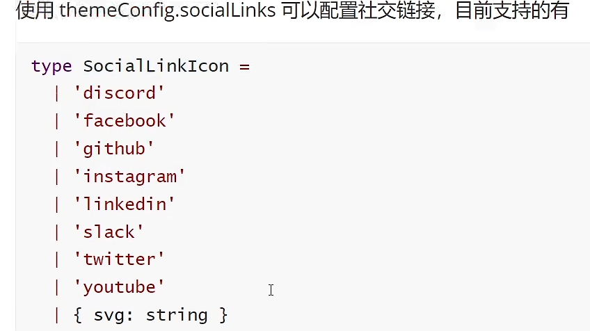

## 如果需要自定义，需要配置 icon

## 网站：https://www.iconfont.cn/

## 复制图片的 svg 代码

## 语法如下

```js
icon:
{
    svg:'图片的svg代码'
},
link: '链接地址'
```

---

# 文章页配置

## 1. 定右侧的 title 标签和显示的标题级数（1-6 级标题）

## 在 config.mjs 文件中的 themeConfig 部分的开头添加如下代码

```javascript
outlineTitle: '文章目录', // 指定右侧栏的title标签名称
outline: [1,3], // 指定右侧,展示的标题级别
```

## 注意：区间是==左闭右开==的

## 2. ==两栏式布局==

## （1）在 themeconfig 中启用这四项功能

```java
outline: [1, 3], // 指定右侧,展示的标题级别
outlineTitle: '文章目录', // 指定右侧栏的title标签名称
sidebar: false, // 关闭侧边栏
aside: "left", // 设置右侧侧边栏在左侧显示
```

## （2）使用两栏式布局文章显示界面的优化（在 theme 中的==style.css 最后追加==如下代码）

```js
/* 自定义侧边栏在最左边，右边撑满宽度 */
:root {
  --vp-layout-top-height: 0px;  /* 设置顶部高度 */
  --vp-doc-top-height: 0px;     /* 设置文档顶部间距 */
}
.VPDoc .container {
  margin: 0 !important;
}
@media (min-width: 960px) {
  .VPDoc:not(.has-sidebar) .content {
    max-width: 1552px !important;
  }
}
.VPDoc.has-aside .content-container {
  max-width: 1488px !important;
}
@media (min-width: 960px) {
  .VPDoc:not(.has-sidebar) .container {
    display: flex;
    justify-content: center;
    max-width: 1562px !important;
  }
}
.aside-container {
  position: fixed;
  top: 0;
  padding-top: calc(
    var(--vp-nav-height) + var(--vp-layout-top-height, 0px) +
      var(--vp-doc-top-height, 0px) + 10px
  ) !important;
  width: 224px; /* 调整 aside 的本身的宽度 */
  height: 100vh;
  overflow-x: hidden;
  overflow-y: auto;
  scrollbar-width: none;
  margin-left: 10px;  /* 调整内容区域与侧边栏的间距 */
}

/* 自定义h2的间距 */
.vp-doc h2 {
  margin: 0px 0 16px;
  padding-top: 24px;
  border: none;
}
```

## （3）如果全局采用侧边栏模式，禁用 aside 属性，但是在某些文章页需要使用两栏式布局，可以在`.md`文件的开头最佳如下代码

```js
---
sidebar: false
aside: left
---
```

## 3. 隐藏 On this page 属性（文章目录结构）

## 在 config.mjs 文件中的 themeConfig 部分的开头添加如下代码

```js
aside: false;
```

## 两栏式布局效果图

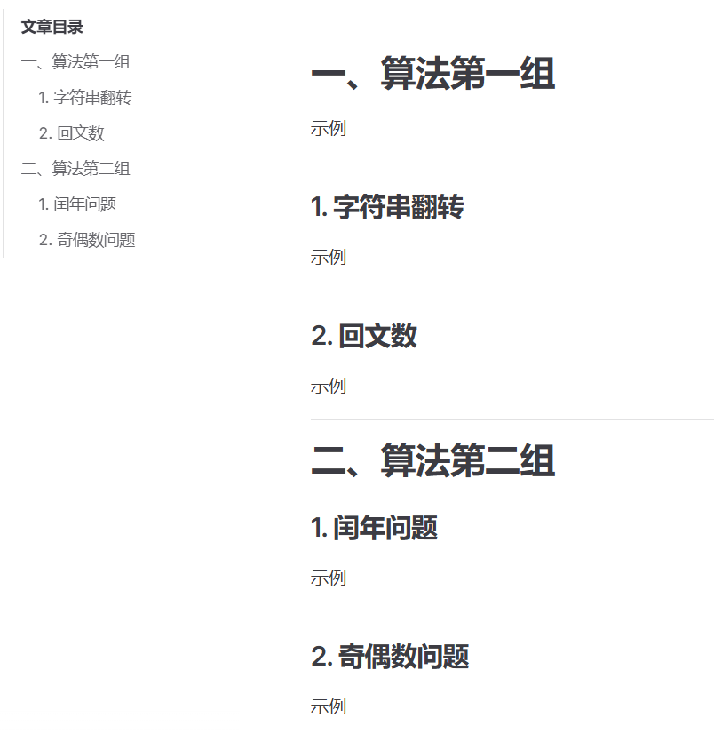

## 4. 测试界面

## 效果图

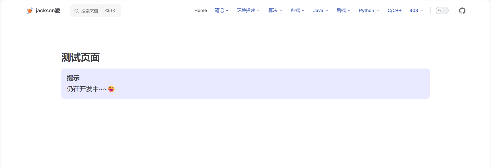

## 源码如下

```js
---
layout: home
---
<br><br><br>  <!-- 换行标签 -->
<span style="font-size: 30px;">**测试页面**</span>
::: tip <span style="font-size: 20px;">提示</span>
<span style="font-size: 20px;">仍在开发中~~:smile:</span>
:::
```

## 说明：通过`<br>`标签来实现换行占位的作用

---

# 优化部分

## 1. 代码块显示功能

- ## 显示行号
- ## 自定义颜色主题

## 在 config.mjs 中的 ==最后==添加如下代码

## ==注意：不要添加在 themconfig 中，否则无效==

```javascript
// markdown 配置
markdown:
    {
        // 代码块主题风格（建议不设置，使用默认的在黑白亮色中都很明显）
        // theme: 'github-light',

        // 代码块显示行数
        lineNumbers: true
    },
```

## 2. 自定义主题

## 主题效果：主页图标呼吸灯背景，代码块炫酷灯条

## 主题连接：https://www.npmjs.com/package/@escook/vitepress-theme

```javascript
pnpm add @escook/vitepress-theme@latest
```

## 文件：theme 目录下的 index.js 文件

## 注释原来所有的内容，添加下面的代码

```javascript
// 1. import vitepress theme
import Theme from "@escook/vitepress-theme";
// 2. import matching CSS styles (this step cannot be omitted)
import "@escook/vitepress-theme/style.css";

// 3. simply set the theme of "import" to "export default"
export default Theme;
```

## 3. 文件下载

## 适用对象：==文本文件==下载

```java
# [点我下载](./index.md){target:"download" download}
```

## 在 markdown 的链接后添加属性`{target:"download" download}`

## 路径中的`.`表示从项目根目录开始

## 4. 文件包含

## 5. 代码分组

## （1）语法

```js
:::code-group

:::
```

## 在中间写多个不同语言的代码

## （2）代码示例

````js
:::code-group

```java
System.our.println("hello world")
```

```python
print("hello world")
```

:::
````

## 效果图

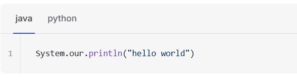

## 6. 容器

## 代码示例

```js
::: info
This is an info box.
:::

::: tip
This is a tip.
:::

::: warning
This is a warning.
:::

::: danger
This is a dangerous warning.
:::

::: details
This is a details block.
:::
```

## 效果图

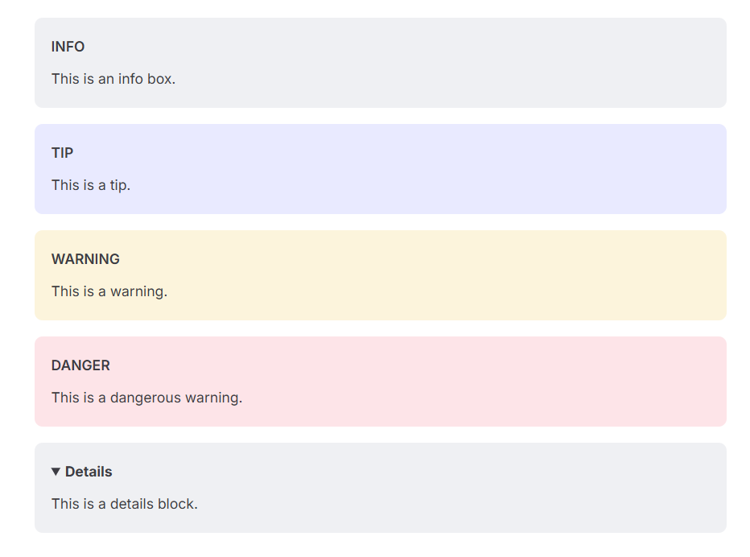

## 说明：Details 标签可以实现内容折叠功能

## 自定义容器标题

## （1）方法一：在容器类别后直接写标题

```js
::: tip 自定义标题
示例
:::
```

## 效果图

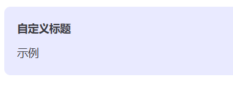

## （2）方法二：全局定义容器的标题

## 在 config.mjs 文件的最后配置如下代码

```js
markdown: {
  container: {
    tipLabel: '提示',
    warningLabel: '警告',
    dangerLabel: '危险',
    infoLabel: '信息',
    detailsLabel: '详细信息'
  }
}
```

## 7. 自动生成文章目录

## 8. 主页优化：烟花效果

## 教学链接：https://juejin.cn/post/7409865546197893171#heading-21

## 其他效果：https://www.kirilv.com/canvas-confetti/

## （1）安装依赖

```bash
pnpm add canvas-confetti
```

## （2）在 theme 目录下创建`confetti.vue`文件

## 复制如下代码粘贴到文件中

```js
// .vitepress/theme/components/confetti.vue
<script setup>
import confetti from "canvas-confetti";
import { inBrowser } from "vitepress";

if (inBrowser) {
  /* 纸屑 */
  confetti({
    particleCount: 100,
    spread: 170,
    origin: { y: 0.6 },
  });
}
</script>
```

## （3）在 theme 目录下的 ==index.js== 文件中的开头导入组件，并注册组件

```js
// https://vitepress.dev/guide/custom-theme
import { h } from "vue";
import DefaultTheme from "vitepress/theme";
import "./style.css";
import confetti from "./confetti.vue"; // 导入插件，主页烟花效果

/** @type {import('vitepress').Theme} */
export default {
  extends: DefaultTheme,
  Layout: () => {
    return h(DefaultTheme.Layout, null, {
      // https://vitepress.dev/guide/extending-default-theme#layout-slots
    });
  },
  enhanceApp({ app, router, siteData }) {
    // ...
    app.component("confetti", confetti); // 注册组件
  },
};
```

## （4）在 ==index.md== 文件中引用，添加到最后

```js
<confetti />
```

## （5）更换其他效果

## 复制网站中需要实现效果对应的代码，在新建的 vue 文件中==替换 if 中的内容==

```js
// .vitepress/theme/components/confetti.vue
<script setup>
import confetti from "canvas-confetti";
import { inBrowser } from "vitepress";

if (inBrowser) {
  /* 纸屑 */
  confetti({
    particleCount: 100,
    spread: 170,
    origin: { y: 0.6 },
  });
}
</script>
```

## 9. 代码块样式美化

## （1）在 theme 目录下新建文件 ==vp-code.css==

## （2）文件中粘贴如下代码

```css
/* .vitepress/theme/style/vp-code.css */

/* 代码块：增加留空边距 增加阴影 */
.vp-doc div[class*="language-"] {
  box-shadow: 0 10px 30px 0 rgb(0 0 0 / 40%);
  padding-top: 20px;
}

/* 代码块：添加macOS风格的小圆点 */
.vp-doc div[class*="language-"]::before {
  content: "";
  display: block;
  position: absolute;
  top: 12px;
  left: 12px;
  width: 12px;
  height: 12px;
  background-color: #ff5f56;
  border-radius: 50%;
  box-shadow: 20px 0 0 #ffbd2e, 40px 0 0 #27c93f;
  z-index: 1;
}

/* 代码块：下移行号 隐藏右侧竖线 */
.vp-doc .line-numbers-wrapper {
  padding-top: 40px;
  border-right: none;
}

/* 代码块：重建行号右侧竖线 */
.vp-doc .line-numbers-wrapper::after {
  content: "";
  position: absolute;
  top: 40px;
  right: 0;
  border-right: 1px solid var(--vp-code-block-divider-color);
  height: calc(100% - 60px);
}

.vp-doc div[class*="language-"].line-numbers-mode {
  margin-bottom: 20px;
}
```

## （3）在 index.js 中导入

```js
import "./vp-code.css";
```

## 效果图

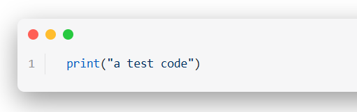

## 10. 侧边栏美化

## （1）在 theme 目录下创建文件 ==sidebarIcon.css==

## （2）粘贴如下代码

```css
/* .vitepress/theme/style/sidebarIcon.css */

/* 侧边栏缩放 */
.group:has([role="button"]) .VPSidebarItem.level-0 .items {
  padding-left: 15px !important;
  border-left: 1px solid var(--vp-c-divider);
  border-radius: 2px;
  transition: background-color 0.25s;
}

/* 侧边栏图标 */
/* 选中所有 .VPSidebarItem 元素，排除带有 .is-link 类的 */
#VPSidebarNav .VPSidebarItem:not(.is-link).collapsed > .item {
  display: inline-flex;
  align-items: center; /* 垂直居中对齐图标和文本 */
}

/* 为所有不带 .is-link 的 .VPSidebarItem 折叠状态添加图标 */
#VPSidebarNav .VPSidebarItem:not(.is-link).collapsed > .item::before {
  content: "";
  background-image: url("/svg/document.svg"); /* 设置图标路径 */
  width: 16px;
  height: 16px;
  display: inline-block;
  vertical-align: middle; /* 确保图标与文本垂直居中 */
  background-size: cover;
  margin-right: 4px; /* 给图标和文本之间增加间距 */
}

#VPSidebarNav .VPSidebarItem:not(.is-link) > .item {
  display: inline-flex;
  align-items: center; /* 垂直居中对齐图标和文本 */
}

/* 为所有不带 .is-link 的 .VPSidebarItem 非折叠状态添加图标 */
#VPSidebarNav .VPSidebarItem:not(.is-link) > .item::before {
  content: "";
  background-image: url("/svg/document-open.svg"); /* 设置图标路径 */
  width: 16px;
  height: 16px;
  display: inline-block;
  vertical-align: middle; /* 确保图标与文本垂直居中 */
  background-size: cover;
  margin-right: 4px; /* 给图标和文本之间增加间距 */
}

/* 选中带有 .is-link 的 .VPSidebarItem 的直接子元素 .item */
#VPSidebarNav .VPSidebarItem.is-link > .item {
  display: inline-flex;
  align-items: center; /* 垂直居中图标和文字 */
}

/* 为选中的 .item 添加图标 */
#VPSidebarNav .VPSidebarItem.is-link > .item::before {
  content: "";
  background-image: url("/svg/file.svg"); /* 图标路径 */
  width: 16px;
  height: 16px;
  display: inline-block;
  vertical-align: middle;
  background-size: cover;
  margin-right: 4px; /* 图标与文字间距 */
}
```

## 注意：把图标路径改成自己的

## 从上到下的三个路径

- ## 第一个折叠侧边栏的图标
- ## 其余折叠侧边栏的突变
- ## 文档的图标

## （3）在 index.js 文件中导入

```js
import "./sidebarIcon.css";
```

## 效果图

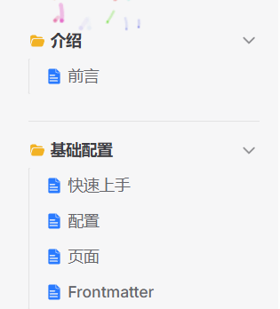

## 11. 首页下划线

## 12. 首页 feature 悬停效果已经阴影背景效果

## 13. 开启图片懒加载

## 作用：快速打开网页，当访问到了图片的位置，它再加载出来

```js
export default defineConfig({
  //markdown配置
  markdown: {
    image: {
      // 开启图片懒加载
      lazyLoading: true,
    },
  },
});
```

## 14. 自定义上下页名

## 在 config.mjs 文件中的主题配置下加上以下信息

```js
themeConfig: {
  //自定义上下页名
  docFooter: {
    prev: '上一页',
    next: '下一页',
  },
},
```
