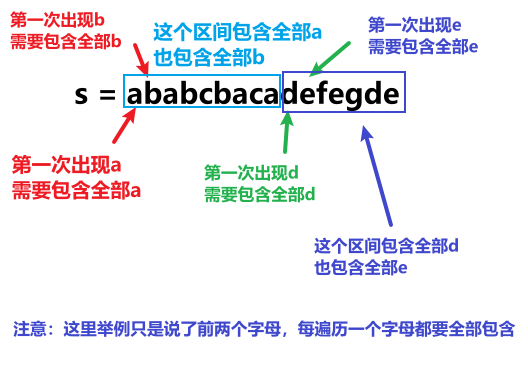

<h1 style="text-align: center; font-weight: bold;">Day 26</h1>

---

今天的三道题目，都算是重叠区间问题，大家可以好好感受一下。 都属于那种看起来好复杂，但一看贪心解法，惊呼：这么巧妙！

这种题还是属于那种，做过了也就会了，没做过就很难想出来。

不过大家把如下三题做了之后， 重叠区间基本上差不多了

## 452. 用最少数量的箭引爆气球

题目链接：https://leetcode.cn/problems/minimum-number-of-arrows-to-burst-balloons/

文章讲解：https://programmercarl.com/0452.%E7%94%A8%E6%9C%80%E5%B0%91%E6%95%B0%E9%87%8F%E7%9A%84%E7%AE%AD%E5%BC%95%E7%88%86%E6%B0%94%E7%90%83.html

视频讲解：https://www.bilibili.com/video/BV1SA41167xe

### 思路分析

> #### 局部最优：当气球出现重叠，一起射，所用弓箭最少

#### 为了让气球尽可能的重叠，需要对数组进行排序

> #### <span style="color:red">按照</span>气球的<span style="color:red">起始位置排序</span>了，那么就从前向后遍历气球数组，靠左尽可能让气球重复


#### 判断重叠思路

> #### 下一个气球的左边界小于上一个气球的右边界

#### 更新边界为最小右边界的目的：判断 i + 1 的气球是否重叠（此时 i - 1 和 i 重叠）

> #### 气球 3 的左边界大于了 第一组重叠气球的最小右边界，所以再需要一支箭来射气球 3 了

### 题解

```java
class Solution {
    public int findMinArrowShots(int[][] points) {
        // 为了尽可能寻找重叠区间，按左边界从小到大排序
        Arrays.sort(points, (o1, o2) -> Integer.compare(o1[0],o2[0]));
        // 初始化弓箭数，至少为一个
        int count = 1;
        // 为了和 i - 1 的元素比较，防止索引越界，从 1 开始遍历
        for (int i = 1; i < points.length; i++) {
            // 下一个元素的左边界大于当前元素的右边界，不重叠
            if (points[i][0] > points[i - 1][1]) {
                count++;
            } else {
                // 更新最小右边界，看第i + 1 个元素是否重叠
                points[i][1] = Math.min(points[i][1], points[i - 1][1]);
            }
        }
        return count;
    }
}
```

## 435. 无重叠区间

题目链接：https://leetcode.cn/problems/non-overlapping-intervals/

文章讲解：https://programmercarl.com/0435.%E6%97%A0%E9%87%8D%E5%8F%A0%E5%8C%BA%E9%97%B4.html

视频讲解：https://www.bilibili.com/video/BV1SA41167xe

### 思路分析

> #### 思路和上一题类似，本质都是<span style="color:red">采用处理重叠区间的思路</span>，本题目的是统计重叠区间的个数，不需要删除元素

### 题解

```java
class Solution {
    public int eraseOverlapIntervals(int[][] intervals) {
        // 和射气球那题差不多，本质都是采用处理重叠区间的思路

        // 按左区间排序，尽可能出现多的重叠区间
        Arrays.sort(intervals, (a, b) -> Integer.compare(a[0], b[0]));
        int count = 0;
        //  为了和 i - 1 比较，从 1 开始，避免下标越界
        for (int i = 1; i < intervals.length; i++) {
            // 区间重叠，更新最小右边界，目的是判断 i + 1 是否重叠
            if (intervals[i][0] < intervals[i - 1][1]) {
                intervals[i][1] = Math.min(intervals[i - 1][1], intervals[i][1]);
                count++;
            }
        }
        return count;
    }
}
```

## 763.划分字母区间

题目链接：https://leetcode.cn/problems/partition-labels/description/

文章讲解：https://programmercarl.com/0763.%E5%88%92%E5%88%86%E5%AD%97%E6%AF%8D%E5%8C%BA%E9%97%B4.html

视频讲解：https://www.bilibili.com/video/BV18G4y1K7d5

### 思路分析

> #### 本题的题意是遍历每一个字母，当第一次遍历到字母后，需要把整个字符串中的字母都包含到这个区间中才算符合题意



#### 在遍历的过程中相当于是要找每一个字母的边界，如果找到之前遍历过的所有字母的最远边界，说明这个边界就是分割点了，此时前面出现过所有字母，最远也就到这个边界了

> #### （1）统计每一个字符最后出现的位置
>
> #### （2）从头遍历字符，并更新字符的最远出现下标，如果找到字符最远出现位置下标和当前下标相等了，则找到了分割点


### 题解

```java
class Solution {
    public List<Integer> partitionLabels(String s) {
        LinkedList<Integer> list = new LinkedList<>();
        int[] hash = new int[26];
        char[] chars = s.toCharArray();
        for (int i = 0; i < chars.length; i++) {
            // 记录每个字母的最后出现位置
            hash[chars[i] - 'a'] = i;
        }
        int start = 0;
        int end = 0;
        for (int i = 0; i < chars.length; i++) {
            // 不断更新最远出现位置
            end = Math.max(end,hash[chars[i] - 'a']);
            // 找到了分割线
            if (i == end){
                // 记录区间长度
                list.add(i - start + 1);
                // 更新起点
                start = i + 1;
            }
        }
        return list;
    }
}
```
