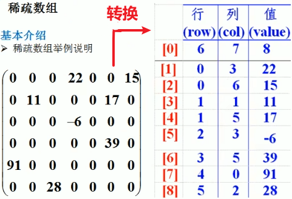

<h1 style="text-align: center;">稀疏矩阵（压缩存储）</h1>

---

## 问题引入

> #### 引入棋盘的场景，如果需要存储哪些方格上有棋子，然而棋盘是很大的，采用二维数组存储必然造成空间的浪费，这个时候采用稀疏矩阵，压缩存储就可以节省空间

<br/>


## 基本介绍

> #### 稀疏矩阵存储
>
> #### （1）固定三列：<span style="color:red;font-weight:bold">row（元素行索引）、col（元素列索引）、val（元素值）</span>
>
> #### （2）第一行：二维矩阵的行数、二维矩阵的列数、二维矩阵中不为 0 元素的个数
>
> #### （3）其余行：存储每个元素的信息

<br/>


## 思路分析

### 1. 二维矩阵转稀疏数组

> #### （1）初始化稀疏数组：遍历二维数组，记录不为 0 的元素个数（即得到稀疏数组的行数）
>
> #### （2）初始化第一行：记录二维矩阵的行数，列数，不为 0 元素的个数
>
> #### （3）记录不为 0 元素的信息：遍历二维数组，把元素的行、列、值信息存储到稀疏矩阵中

### 2. 稀疏数组转二维矩阵

> #### （1）初始化二维矩阵：根据稀疏数组的第一行数据初始化
>
> #### （2）添加元素到二维矩阵中：遍历稀疏矩阵（<span style="color:red">从第二行开始遍历</span>），根据元素的位置和值在二维矩阵中赋值

## 代码实现

```java
package chapter1_稀疏数组;

/**
 * 稀疏数组：压缩矩阵存储
 * 稀疏数组的三列：row col val
 */
public class SparseArray {
    public static void main(String[] args) {

        // 二维矩阵 --> 稀疏数组

        // 1. 初始化二维矩阵（0表示没有值，1表示存储值）
        int[][] array = new int[11][11];
        // 第二行第三列
        array[1][2] = 1;
        // 第三行第四列
        array[2][3] = 1;
        // 第五行第六列
        array[4][5] = 1;

        // 打印测试：二维矩阵
        System.out.println("======二维矩阵如下======");
        for (int[] arrays : array) {
            for (int value : arrays) {
                System.out.print(value + "\t");
            }
            System.out.println();
        }

        // 2. 统计非 0 数据，用于初始化稀疏数组
        int sum = 0;
        for (int i = 0; i < 11; i++) {
            for (int j = 0; j < 11; j++) {
                if (array[i][j] != 0) {
                    sum++;
                }
            }
        }

        // 3. 初始化稀疏数组（行数多一行：第一行存储二维矩阵的信息）
        int[][] sparseArray = new int[sum + 1][3];
        sparseArray[0][0] = 11;
        sparseArray[0][1] = 11;
        sparseArray[0][2] = sum;

        // 用于记录第几个非 0 数据，同时用稀疏矩阵的行索引自增
        int count = 0;

        // 4. 遍历二维矩阵，把不为 0 的数据信息添加到稀疏矩阵中
        for (int i = 0; i < 11; i++) {
            for (int j = 0; j < 11; j++) {
                if (array[i][j] != 0) {
                    // 从第一行开始放入数据
                    count++;
                    sparseArray[count][0] = i;
                    sparseArray[count][1] = j;
                    sparseArray[count][2] = array[i][j];
                }
            }
        }

        // 打印测试：稀疏矩阵
        System.out.println("======稀疏矩阵如下======");
        for (int[] arrays : sparseArray) {
            for (int value : arrays) {
                System.out.print(value + "\t");
            }
            System.out.println();
        }

        // 稀疏矩阵 --> 二维矩阵

        // 1. 根据第一行数据信息，初始化二维矩阵
        int[][] newArray = new int[sparseArray[0][0]][sparseArray[0][1]];

        // 2. 遍历稀疏数组，转二维矩阵（易错：需要从第二行开始遍历）
        for (int i = 1; i < sparseArray.length; i++) {
            newArray[sparseArray[i][0]][sparseArray[i][1]] = sparseArray[i][2];
        }

        // 3. 打印测试
        System.out.println("======新的二维矩阵======");
        for (int[] arrays : newArray) {
            for (int value : arrays) {
                System.out.print(value + "\t");
            }
            System.out.println();
        }
    }
}
```

## 代码完善（IO 文件读写）
