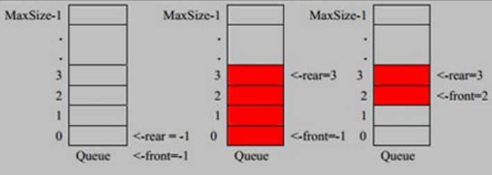

<h1 style="text-align: center;">队列</h1>

---

## 基本介绍



> #### 队列的特点：<span style="color:red">先进先出</span>，只能在<span style="color:red">队头移除</span>数据，只能在<span style="color:red">队尾添加</span>数据

#### 队列的基本属性

> #### front：队列指针（数组下标索引）
>
> #### rear：队尾指针（数组下标索引）
>
> #### maxsize：队列存储容量
>
> #### arr：队列，采用数组实现

### 传统队列

> #### 初始化时：<span style="color:red">front = rear = -1</span>
>
> #### 带来的问题：当不断出队后，队头指针后移，直到 front = rear，此时队列为空，但是根据逻辑判断，无法继续添加数据，<span style="color:red">造成了空间的浪费</span>

### 循环队列 ⭐

#### （1）采用<span style="color:red">预留一个空间大小</span>的结构（即<span style="color:red">存储元素的个数为队列大小减一</span>），存储元素

#### （2）初始化

> #### <span style="color:red">front = rear = 0</span>
>
> #### front：指向队头元素
>
> #### rear：指向队尾元素的<span style="color:red">后一个位置</span>

#### （3）移动指针

```java
int front = (front + 1) % maxsize;
int rear = (rear + 1) % maxsize;
```

#### （4）队空

```java
int front = rear;
```

#### （5）队满（队列元素个数）

```java
int front = (raer - front + maxsize) % maxsize;
```

## 代码实现

```java
package chapter2_队列;

/**
 * ClassName: Queue
 * Package: chapter2_队列
 * Description:
 *
 * @author jacksonling
 * @version 1.0
 * @Date 2025-08-06 21:24
 */
public class Queue {
    // 定义属性
    public int front; // 队头指针
    public int rear; // 队尾指针
    public int maxsize; // 队列容量
    public int[] circleQueue; // 队列

    /*
        注意
        （1）循环队列采用预留一个空间大小的设计
        （2）即存储元素的个数为队列容量大小减一
     */
    // 构造器：初始化
    public Queue(int size) {
        this.front = 0;
        this.rear = 0;
        this.maxsize = size;
        this.circleQueue = new int[size];
    }

    // 判断是否为空
    public boolean isEmpty() {
        return front == rear;
    }

    // 判断是否队满
    public boolean isFull() {
        return (rear + 1) % maxsize == front;
    }

    // 获取队列大小
    public int size() {
        return (rear - front + maxsize) % maxsize;
    }

    // 取队头元素
    public int getHead() {
        // 首先判断队列是否为空
        if (isEmpty()){
            throw new RuntimeException("队列为空，无法取队头元素");
        }
        return circleQueue[front];
    }

    // 增
    public void enQueue(int val) {
        // 首先判断是否队满
        if (isFull()) {
            throw new RuntimeException("队列已满，无法继续添加");
        }
        // 队尾指针指向的是队尾元素的下一个位置，直接添加即可
        circleQueue[rear] = val;
        rear = (rear + 1) % maxsize;
    }

    // 删
    public void deQueue() {
        // 首先判断是否队空
        if (isEmpty()) {
            throw new RuntimeException("队列为空，无法出队");
        }
        front = (front + 1) % maxsize;
    }

    // 查
    public void showQueue() {
        if (isEmpty()){
            System.out.println("队列为空，没有任何元素");
        }
        System.out.println("=======队列元素如下=======");
        for (int i = front; i < front + size(); i++) {
            System.out.print(circleQueue[i % maxsize] + " ");
        }
        System.out.println();
    }
}
```

## 测试代码

```java
package chapter2_队列;

import java.util.InputMismatchException;
import java.util.Scanner;

/**
 * ClassName: test
 * Package: chapter2_队列
 * Description:
 *
 * @author jacksonling
 * @version 1.0
 * @Date 2025-08-06 21:50
 */
public class Test {
    public static void main(String[] args) {
        Queue circleQueue = new Queue(5);
        Scanner scanner = new Scanner(System.in);
        boolean loop = true;
        try {
            while (loop) {
                System.out.println("=====输入数字选择功能=====");
                System.out.println("1. 判断队空（isEmpty）");
                System.out.println("2. 判断队满（isFull）");
                System.out.println("3. 队列大小（size）");
                System.out.println("4. 获取队头元素（getHead()）");
                System.out.println("5. 入队（enQueue）");
                System.out.println("6. 出队（deQueue）");
                System.out.println("7. 打印队列（showQueue）");
                System.out.println("0. 退出");
                System.out.print("请输入你的选择（数字）：");
                int choice = scanner.nextInt();
                switch (choice) {
                    case 1:
                        if (circleQueue.isEmpty()) {
                            System.out.println("队列为空");
                        } else {
                            System.out.println("队列不为空");
                        }
                        break;
                    case 2:
                        if (circleQueue.isFull()) {
                            System.out.println("队列已满");
                        } else {
                            System.out.println("队列未满");
                        }
                        break;
                    case 3:
                        System.out.println("队列的大小：" + circleQueue.size());
                        break;
                    case 4:
                        try {
                            System.out.println("队头元素为：" + circleQueue.getHead());
                        } catch (Exception e) {
                            e.printStackTrace();
                        }
                        break;
                    case 5:
                        try {
                            System.out.print("请输入队元素：");
                            int enQueueVal = scanner.nextInt();
                            circleQueue.enQueue(enQueueVal);
                            System.out.println("入队成功");
                        } catch (Exception e) {
                            e.printStackTrace();
                        }
                        break;
                    case 6:
                        try {
                            circleQueue.deQueue();
                            System.out.println("出队成功");
                        } catch (Exception e) {
                            e.printStackTrace();
                        }
                        break;
                    case 7:
                        circleQueue.showQueue();
                        break;
                    case 0:
                        loop = false;
                        break;
                    default:
                        System.out.println("你的输入有误，请重新输入");
                }
            }
        } catch (InputMismatchException e) {
            System.out.println("输入无效，请输入数字");
            scanner.nextLine(); // 清空输入缓冲区
        }
        // 关闭资源
        scanner.close();
    }
}
```
