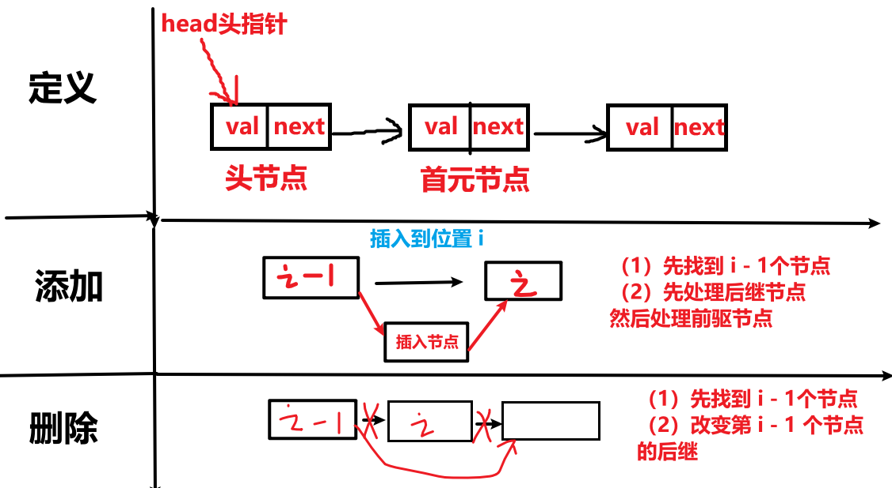
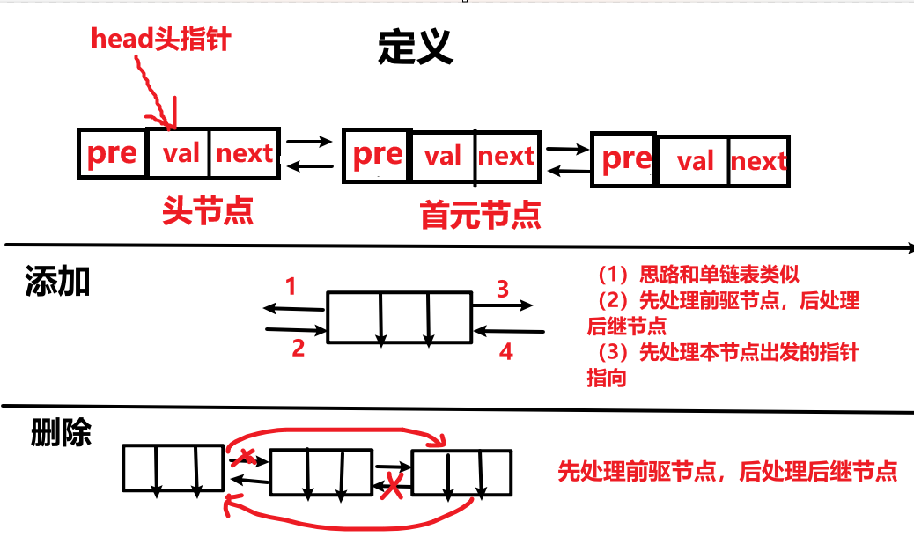
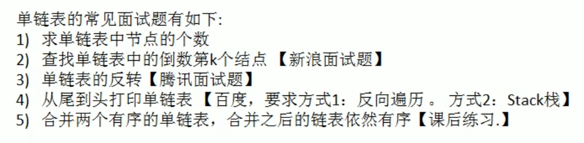

<h1 style="text-align: center;">链表</h1>

---

## 单向链表



### 代码示例

```java
package chapter3_链表.单向链表;

import java.util.Scanner;

// 单链表
public class LinkedList {
    // 定义头指针
    Node head;

    // 初始化：头指针指向头节点
    public LinkedList() {
        this.head = new Node(0);
    }

    // 是否为空
    public void isEmpty() {
        if (head.next == null) {
            System.out.println("链表为空");
        } else {
            System.out.println("链表不为空");
        }
    }

    // 获取大小
    public int size() {
        int cnt = 0;
        // 从首元节点开始
        Node temp = head;
        while (temp.next != null) {
            cnt++;
            temp = temp.next;
        }
        return cnt;
    }

    // 增
    public void add(int index, int val) {
        // 可以在末尾添加
        if (index < 0 || index > size()) {
            System.out.println("索引越界，请输入正确的索引");
        }
        Node temp = head;
        // 充当下标索引的作用
        int cnt = 0;
        // 找到 index - 1 个节点
        while (temp != null && cnt < index) {
            temp = temp.next;
            cnt++;
        }

        // 退出循环，此时指针指向第 index - 1 个元素

        // 创建新节点
        Node newNode = new Node(val);

        // 插入元素
        newNode.next = temp.next;
        temp.next = newNode;

        System.out.println("添加成功");
    }

    // 删除
    public void remove(int index) {
        if (index < 0 || index >= size()) {
            System.out.println("索引越界，请输入正确的索引");
        }
        // 初始指向头节点，首元节点是第 0 个元素
        Node temp = head;
        int cnt = 0;
        // 找到 index - 1 个节点
        while (temp != null && cnt < index) {
            temp = temp.next;
            cnt++;
        }
        // 退出循环，此时指针指向第 index - 1 个元素

        // 删除
        Node q = temp.next;
        temp.next = q.next;
        q.next = null;

        System.out.println("删除成功");
    }

    // 查
    public void showLinkedList() {
        if (head.next == null) {
            System.out.println("链表为空");
            return;
        }
        // 初始指向首元节点
        Node temp = head.next;
        while (temp != null) {
            System.out.print(temp.val + "-->");
            temp = temp.next;
        }
    }

}

// 节点
class Node {
    int val;
    Node next;

    public Node(int val) {
        this.val = val;
        this.next = null;
    }
}
```

### 测试代码

```java
public class Test{
    public static void main(String[] args) {
        LinkedList linkedList = new LinkedList();
        boolean loop = true;
        Scanner scanner = new Scanner(System.in);  // 只创建一次 Scanner
        while (loop) {
            System.out.println("1. 是否为空");
            System.out.println("2. 大小");
            System.out.println("3. 添加");
            System.out.println("4. 删除");
            System.out.println("5. 打印链表");
            System.out.println("6. 退出");
            System.out.print("输入你的选择：");
            int choice = scanner.nextInt();
            switch (choice) {
                case 1:
                    linkedList.isEmpty();
                    break;
                case 2:
                    int size = linkedList.size();
                    System.out.println("链表的元素个数为：" + size);
                    break;
                case 3:
                    System.out.print("输入添加元素的索引：");
                    int a = scanner.nextInt();
                    System.out.print("输入添加的元素值：");
                    int b = scanner.nextInt();
                    linkedList.add(a, b);
                    break;
                case 4:
                    System.out.print("输入删除元素的索引：");
                    int c = scanner.nextInt();
                    linkedList.remove(c);
                    break;
                case 5:
                    linkedList.showLinkedList();
                    break;
                case 6:
                    loop = false;
                    break;
                default:
                    System.out.println("你的输入有误，重新输入");
                    break;
            }
        }
    }
}
```

## 双向链表



### 代码示例

### 测试代码

## 单向循环链表

### 代码示例

### 测试代码

## 练习题


