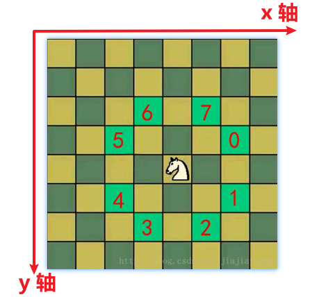

<h1 style="text-align: center;">马踏棋盘算法</h1>

---

## 游戏连接

> #### https://h5.17173.com/content/05252016/143559215.shtml

## 基本介绍

> #### 马踏棋盘算法又称为骑士周游问题

#### 游戏规则

> #### 只能走日字，棋盘上的每一个点都需要走一遍才算成功

#### 相关考点

> #### 图的深度遍历
>
> #### 回溯思想
>
> #### 贪心思想优化

## 类补充

> #### <span style="color:red">Point 类</span>，它是 Java AWT（Abstract Window Toolkit）库中的一个基础类，用于<span style="color:red">表示二维坐标系中的点</span>
>
> #### 包含两个属性：x：点的 X 坐标（水平位置）；y：点的 Y 坐标（垂直位置）

## 思路分析

> #### 1. 创建棋盘 `chessBoard`，是二维数组
>
> #### 2. 将当前位置设置为已经访问，然后根据当前位置，计算马儿还能走哪些位置，并放入到一个集合中 (`ArrayList`)，最多有 8 个，每走一步，使用 `step + 1`
>
> #### 3. 遍历 `ArrayList` 中存放的所有位置，看看那个可以走，如果可以走通，就继续；走不通，就回溯
>
> #### 4. 判断马儿是否完成了任务，使用 `step` 和应该走的步数比较，如果没有达到数量，则表示没有完成任务，将整个棋盘设置为 0

> #### 注意：马儿走的策略不同，则得到的结果也不一样，效率也不一样。



## 代码实现

```java
import java.awt.*;
import java.util.ArrayList;

public class HorseChessBoard {

    // 初始化属性

    // 棋盘大小
    private static int X = 6;
    private static int Y = 6;
    // 棋盘
    private static int[][] chessBoard = new int[Y][X];

    // 是否访问过，用数组记录
    private static boolean vistited[] = new boolean[X * Y];

    // 记录是否遍历完棋盘
    private static boolean finished = false;

    // 主函数：测试
    public static void main(String[] args) {
        // 初始位置（坐标）
        int row = 6;
        int col = 1;
        // 测试
        long start = System.currentTimeMillis();
        // 需要传入数组下标，因为是二维矩阵
        traversalChessBoard(chessBoard, row - 1, col - 1, 1);
        long end = System.currentTimeMillis();
        System.out.println("执行耗时：" + (end - start));
        // 打印结果
        for (int[] rows : chessBoard) {
            for (int val : rows) {
                System.out.print(val + "\t");
            }
            System.out.println();
        }
    }

    // 核心代码，遍历棋盘
    public static void traversalChessBoard(int[][] chessBoard, int row, int col, int step) {
        // 把 step 记录到 chessBoard 中
        chessBoard[row][col] = step;
        // 设置该位置已经访问过（位置下标由二维矩阵推算）
        vistited[row * X + col] = true;
        // 获取从当前位置开始，下一个可以走的位置有哪些
        ArrayList<Point> points = next(new Point(col, row)); // 主函数传入的起始坐标
        // 遍历
        while (!points.isEmpty()) {
            // 取集合中的第一个点
            Point p = points.remove(0);
            // 判断是否走过
            if (!vistited[p.y * X + p.x]) {
                // 递归遍历（先传行再传列）
                traversalChessBoard(chessBoard, p.y, p.x, step + 1);
            }
        }
        // 遍历结束，判断是否走完棋盘，如果没有遍历成功就重置，然后回溯
        if (step < X * Y && !finished) {
            chessBoard[row][col] = 0;
            vistited[row * X + col] = false;
        } else {
            finished = true;
        }
    }


    // 创建ArrayList，用来存储可以走的位置（加入判断逻辑，该位置是否合理）
    public static ArrayList<Point> next(Point curPoint) {
        // 创建ArrayList
        ArrayList<Point> points = new ArrayList<>();

        // 创建 Point 对象
        Point point = new Point();

        //判断在 curPoint 是否可以走如下位置，如果可以走，就将该点(Point) 放入到points

        //判断是否可以走5位置
        if ((point.x = curPoint.x - 2) >= 0 && (point.y = curPoint.y - 1) >= 0) {
            points.add(new Point(point)); //这里一定要new Point
        }
        //判断是否可以走6位置
        if ((point.x = curPoint.x - 1) >= 0 && (point.y = curPoint.y - 2) >= 0) {
            points.add(new Point(point)); //这里一定要new Point
        }
        //判断是否可以走7位置
        if ((point.x = curPoint.x + 1) < X && (point.y = curPoint.y - 2) >= 0) {
            points.add(new Point(point)); //这里一定要new Point
        }
        //判断是否可以走0位置
        if ((point.x = curPoint.x + 2) < X && (point.y = curPoint.y - 1) >= 0) {
            points.add(new Point(point)); //这里一定要new Point
        }
        //判断是否可以走1位置
        if ((point.x = curPoint.x + 2) < X && (point.y = curPoint.y + 1) < Y) {
            points.add(new Point(point)); //这里一定要new Point
        }
        //判断是否可以走2位置
        if ((point.x = curPoint.x + 1) < X && (point.y = curPoint.y + 2) < Y) {
            points.add(new Point(point)); //这里一定要new Point
        }
        //判断是否可以走3位置
        if ((point.x = curPoint.x - 1) >= 0 && (point.y = curPoint.y + 2) < Y) {
            points.add(new Point(point)); //这里一定要new Point
        }
        //判断是否可以走4位置
        if ((point.x = curPoint.x - 2) >= 0 && (point.y = curPoint.y + 1) < Y) {
            points.add(new Point(point)); //这里一定要new Point
        }
        return points;
    }
}
```

## 贪心优化

> #### 1. 我们现在走的下一个位置，是按照顺时针来挑选位置，因此选择的这个点的下一个可走位置的个数不确定
>
> #### 2. 优化思路：应选择下一个的下一个可走位置较少的点开始走，以此<span style="color:red">减少回溯次数</span>
>
> #### 3. 代码：对 <span style="color:red">ArrayList 集合</span>按可走下一个位置的次数进行<span style="color:red">升序排序 </span>

```java
public static void sort(ArrayList<Point> ps) {
    ps.sort(new Comparator<Point>() {
        @Override
        public int compare(Point o1, Point o2) {
            return next(o1).size() - next(o2).size();
        }
    });
}
```

## 最终代码

```java
import java.awt.*;
import java.util.ArrayList;
import java.util.Comparator;

public class HorseChessBoard {

    // 初始化属性

    // 棋盘大小
    private static int X = 6;
    private static int Y = 6;
    // 棋盘
    private static int[][] chessBoard = new int[Y][X];

    // 是否访问过，用数组记录
    private static boolean vistited[] = new boolean[X * Y];

    // 记录是否遍历完棋盘
    private static boolean finished = false;

    // 主函数：测试
    public static void main(String[] args) {
        // 初始位置（坐标）
        int row = 2;
        int col = 2;
        // 测试
        long start = System.currentTimeMillis();
        // 需要传入数组下标，因为是二维矩阵
        traversalChessBoard(chessBoard, row - 1, col - 1, 1);
        long end = System.currentTimeMillis();
        System.out.println("执行耗时：" + (end - start));
        // 打印结果
        for (int[] rows : chessBoard) {
            for (int val : rows) {
                System.out.print(val + "\t");
            }
            System.out.println();
        }
    }
    // 贪心优化，对可走点进行升序排序
    public static void sort(ArrayList<Point> ps) {
        ps.sort(new Comparator<Point>() {
            @Override
            public int compare(Point o1, Point o2) {
                return next(o1).size() - next(o2).size();
            }
        });
    }
    // 核心代码，遍历棋盘
    public static void traversalChessBoard(int[][] chessBoard, int row, int col, int step) {
        // 把 step 记录到 chessBoard 中
        chessBoard[row][col] = step;
        // 设置该位置已经访问过（位置下标由二维矩阵推算）
        vistited[row * X + col] = true;
        // 获取从当前位置开始，下一个可以走的位置有哪些
        ArrayList<Point> points = next(new Point(col, row)); // 主函数传入的起始坐标
        // 贪心优化，先排序
        sort(points);
        // 遍历
        while (!points.isEmpty()) {
            // 取集合中的第一个点
            Point p = points.remove(0);
            // 判断是否走过
            if (!vistited[p.y * X + p.x]) {
                // 递归遍历（先传行再传列）
                traversalChessBoard(chessBoard, p.y, p.x, step + 1);
            }
        }
        // 遍历结束，判断是否走完棋盘，如果没有遍历成功就重置，然后回溯
        if (step < X * Y && !finished) {
            chessBoard[row][col] = 0;
            vistited[row * X + col] = false;
        } else {
            finished = true;
        }
    }


    // 创建ArrayList，用来存储可以走的位置（加入判断逻辑，该位置是否合理）
    public static ArrayList<Point> next(Point curPoint) {
        // 创建ArrayList
        ArrayList<Point> points = new ArrayList<>();

        // 创建 Point 对象
        Point point = new Point();

        //判断在 curPoint 是否可以走如下位置，如果可以走，就将该点(Point) 放入到points

        //判断是否可以走5位置
        if ((point.x = curPoint.x - 2) >= 0 && (point.y = curPoint.y - 1) >= 0) {
            points.add(new Point(point)); //这里一定要new Point
        }
        //判断是否可以走6位置
        if ((point.x = curPoint.x - 1) >= 0 && (point.y = curPoint.y - 2) >= 0) {
            points.add(new Point(point)); //这里一定要new Point
        }
        //判断是否可以走7位置
        if ((point.x = curPoint.x + 1) < X && (point.y = curPoint.y - 2) >= 0) {
            points.add(new Point(point)); //这里一定要new Point
        }
        //判断是否可以走0位置
        if ((point.x = curPoint.x + 2) < X && (point.y = curPoint.y - 1) >= 0) {
            points.add(new Point(point)); //这里一定要new Point
        }
        //判断是否可以走1位置
        if ((point.x = curPoint.x + 2) < X && (point.y = curPoint.y + 1) < Y) {
            points.add(new Point(point)); //这里一定要new Point
        }
        //判断是否可以走2位置
        if ((point.x = curPoint.x + 1) < X && (point.y = curPoint.y + 2) < Y) {
            points.add(new Point(point)); //这里一定要new Point
        }
        //判断是否可以走3位置
        if ((point.x = curPoint.x - 1) >= 0 && (point.y = curPoint.y + 2) < Y) {
            points.add(new Point(point)); //这里一定要new Point
        }
        //判断是否可以走4位置
        if ((point.x = curPoint.x - 2) >= 0 && (point.y = curPoint.y + 1) < Y) {
            points.add(new Point(point)); //这里一定要new Point
        }
        return points;
    }
}
```
