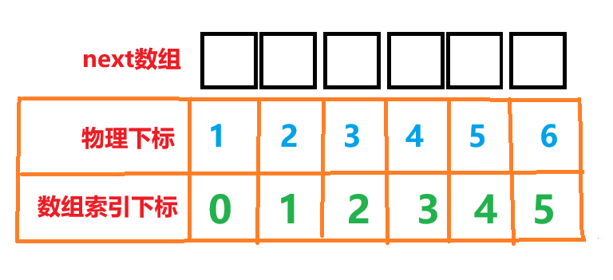
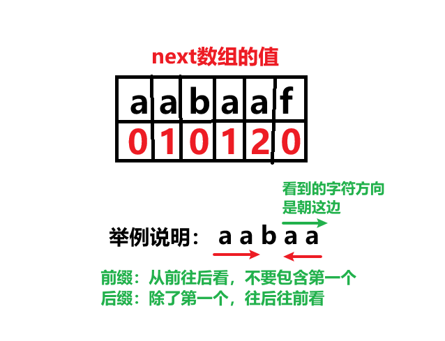
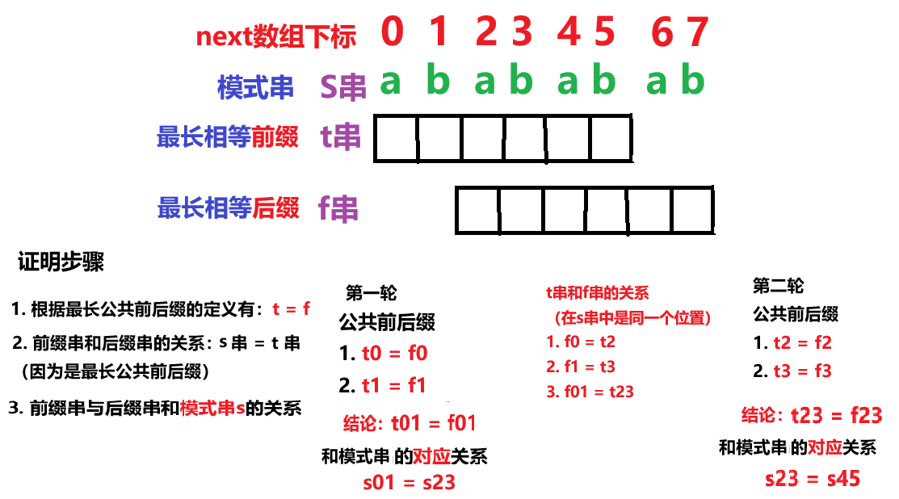

# <center>字符串</center>

## 1. BF 算法

## 2. KMP 算法

### (1) KMP 是什么

- 名字来由

  > KMP 算法的名字来源于其三位发明者 Donald Knuth、Vaughan Pratt 和 James H. Morris 的姓氏首字母

- 是什么
  > KMP 算法是一种字符串匹配算法，时间效率上能够**更加高效**，特点是利用<span style="color:red;font-weight:bold">前缀表</span>
- <span style="color:red;font-weight:bold">核心思想</span>
  > **当出现字符串不匹配时，可以知道一部分之前已经匹配的文本内容（<span style="color:red;font-weight:bold">模式串</span>），可以利用这些信息避免从头再去做匹配了**

### (2) 前缀表

#### 1. 引出

> 根据 KMP 的算法核心思想，以此引出了前缀表，**当字符串不匹配时，可以通过查询前缀表，进而知道<span style="color:red;font-weight:bold">应该回退到哪个位置</span>继续匹配**

#### 2. 什么是**前缀**？

> **前缀是指不包含<span style="color:red;font-weight:bold">最后一个</span>字符的所有以第一个字符开头的连续子串**
> 举个例子，现有字符串<span style="color:red;font-weight:bold">aabcef</span>，请找出所有**前缀**

<div style="position: relative; left: 30%; width: 80%;">
1. a<br/>
2. aa<br/>
3. aab<br/>
4. aabc<br/>
5. aabce<br/>
</div>

#### 3. 什么是**后缀**？(<span style="color:red;font-weight:bold">不是从后面往前面找，注意</span>❗❗❗)

> **后缀是指不包含<span style="color:red;font-weight:bold">第一个</span>字符的所有以最后一个字符结尾的连续子串**
> 举个例子，现有字符串<span style="color:red;font-weight:bold">aabcef</span>，请找出所有**后缀**

<div style="position: relative; left: 30%; width: 80%;">
1. f<br/>
2. ef<br/>
3. cef<br/>
4. bcef<br/>
5. abcef<br/>
</div>


#### 4. 什么是**最长公共前后缀**？

> 在前面的基础下，我们已经会找前缀和后缀了，这个时候可以把二者进行对比，**如果<span style="color:red;font-weight:bold">前缀等于后缀</span>，我们就找到了<span style="color:red;font-weight:bold">公共前后缀</span>，这是前缀表的<span style="color:red;font-weight:bold">核心</span>**<br/><span style="color:red;font-weight:bold">KMP</span>算法中，我是寻找的是<span style="color:red;font-weight:bold">最长</span>**公共前后缀**

#### 来看一个案例，在前缀表中记录了回退的位置，这样可以减少重复匹配的次数，进而提高匹配效率


#### 5. ⚠️ 前缀表引出 ⚠️

- **当匹配失败时，我门可以通过前缀表知道当前匹配失败的位置需要回溯到哪个位置继续下一次匹配**
- **为什么可以通过前缀表知道回退到哪个位置？前面提到了**<span style="color:red;font-weight:bold">最长</span>**公共前后缀的概念，然而前缀表记录的就是每一个字符当前位置**<span style="color:red;font-weight:bold">之前</span>**的最长公共前后缀，这样可以减少重复匹配的字符，提高了匹配效率，这正是 KMP 算法的核心**

#### 6. KMP 的匹配过程如下


#### 7. 前缀表与 next 数组

#### next 数组就可以是前缀表，但是很多实现都是把前缀表统一减一（右移一位，初始位置为-1）之后作为 next 数组。

#### 其实这并不涉及到 KMP 的原理，而是<span style="color:red;font-weight:bold">具体实现</span>，next 数组既可以就是前缀表，也可以是前缀表统一减一（右移一位，初始位置为-1）。

> 能否解释一个下 next 和含义？
>
> 上面提到，next 数组可以是前缀表，前缀表中存储了最长公共前后缀的信息，说白了，就是当字符串匹配失配时，通过前缀表可以知道应该回退到哪个位置，也就是下次（next）需要到达的位置

### (3) <span style = "color:red;font-weight:bold">next 数组计算</span>

> #### 说明：直接使用<span style="color:red;font-weight:bold">前缀表作为 next 数组</span>，而不是通过前缀表统一减一的方式计算 next 数组

> #### 不匹配时如何回退？
>
> #### 需要找到当前失配字符的<span style="color:red;font-weight:bold">前一位</span>元素的数组下标索引，并在 next 数组中找到该索引对应的值

> #### ⚠️<span style="color:red;font-weight:bold">为什么是前一位？</span>
>
> #### 前缀表中我们记录的是最长公共前后缀的<span style="color:red;font-weight:bold">个数</span>，然而元素的<span style="color:red;font-weight:bold">索引下标 = 物理位置 - 1 </span>，因为<span style="color:red;font-weight:bold">数组的下标是从 0 开始</span>的，也就是说当前<span style="color:red;font-weight:bold">失配</span>字符应该回退的位置-->是在当前失配字符<span style="color:red;font-weight:bold">前面这个字符</span>的下标索引在 next 数组中对应的值

> #### 举个例子

> #### 我们需要找到第 6 个元素的 next 数组值，可以发现第 6 个元素放在数组中，下标就变成了 5，也就是说如果我们需要找某一个元素（<span style="color:red;font-weight:bold">物理位置</span>）的 next 数组值，那么第 6 个元素在 next 数组中对应的<span style="color:red;font-weight:bold">索引值 = 物理位置 - 1</span>，那物理位置 - 1 不就是当前失配元素的<span style="color:red;font-weight:bold">前一个元素</span>

#### <span style="color:blue;font-weight:bold;font-size:28px">结论：那么当前失配元素的前一个元素对应的 next 数组值就是当前失配元素的 next 数组值 ❗❗❗ </span>



#### 手算 next 数组

> #### 如果是要求某个字符对应的在 next 数组中的值，应该<span style="color:red;font-weight:bold">从第一个字符开始，取到该字符长度的字串</span>，计算其最长公共前后缀长度



<h2>代码实现部分</h2>

#### 1. 初始化

指针 i 的含义（文本串指针）

> **指向<span style="color:red;font-weight:bold">后缀</span>的末尾**
>
> 理解为什么是指向**后缀末尾**?
>
> i 是文本串指针，在匹配中会一直往后移动，并且一定是指向当前匹配字符串的末尾，不可能到前面去，那不就是符合后缀的定义了

指针 j 的含义（模式串指针 && **next 数组指针**）

> - **指向<span style="color:red;font-weight:bold">前缀</span>的末尾**
>
> 理解为什么是指向**前缀末尾**？
>
> j 是模式串指针，在匹配过程中，如果发现模式串的字符和文本串的字符不匹配，=那 j 就会回退，j 处于这种回退的状态下是不可能指向末尾的，只有当模式串全部匹配 j 才会走到模式串的末尾，这一特性正好符合了前缀指针的特性
>
> - **表示指向 i 之前（<span style="color:red;font-weight:bold">包括 i</span>）字串的最长相等前后缀的长度**
>   > - 因为 j 可以是 next 数组指针，指向 next 数组下标对应的值就是最长公共前后缀长度
>   > - 然而 next 数组就存储了当字符串匹配**失配**（当前 i 指向的位置）时，next[j]提供的信息告诉我们在失配时，通过计算最长公共前后缀知道 j 指针应该回溯的位置，跳过一些字符避免重复匹配进而提高效率

next[i] 的含义

> **表示 i（包括 i）之前最长相等的前后缀长度（其实就是 j）**

#### 2. 四步求解法

#### （1）初始化 i、j

<span style="color:red;font-weight:bold;font-size:20px">易错：i 的起始值为 1❗❗❗</span>

```java
j = 0;
next[0] = 0;
for(int i = 1; i < s.size; i++){

}
```

#### 解释

- **j = 0**：j 是模式串指针，同时还是前缀指针，应该处于最开始的位置，初始化为 0
- **i = 1**：i 是文本串指针，同时还是后缀指针，不能指向第一个元素，因为我们需要计算 next 数组，<span style="color:red;font-weight:bold">目的就是比较前缀和后缀</span>，初始化为 1
- **next[0] = 0**：第一个元素前面就没有元素，压根就没有公共前后缀，更别提更长了，显示是初始化为 0

#### （2）前后缀不相同

前后缀不相同，也就是失配的情况，这是个时候应该根据 next 数组回退，<span style="color:red;font-weight:bold">回退一次后可能仍然不匹配，这是一个持续的过程</span>

```java
while(j > 0 && s[i] != s[j]){
    j = next[j - 1];
}
```

#### 解释

- **j - 1**：我们采用<span style="color:red;font-weight:bold">前缀表作为 next 数组</span>，那失配时应该是找当前失配元素的<span style="color:red;font-weight:bold">前一个</span>字符的下标索引在 next 数组中对应的值
- **j > 0**：因为 **j - 1** 的缘故，为了不出现数组下标越界的问题，这里增加一个判断条件

#### （3）前后缀相同

前后缀相同，也就是匹配的情况，这个时候需要增加最长公共前后缀的长度，直到找到<span style="color:red;font-weight:bold">最长</span>的**公共前后缀**

```java
if(s[i] == s[j]){
    j++;
}
```

#### 解释

> 因为 j 不仅是表示指向前缀的末尾，还**表示指向 i 之前（<span style="color:red;font-weight:bold">包括 i</span>）字串的<span style="color:red;font-weight:bold">最长相等前后缀</span>的长度**，更新相等前后缀的长度

#### （4）更新 next 数组

```java
next[i] = j;
```

#### 解释

> - 首先需要更新 next 数组的值，也就是最长公共前后缀的长度，那这个长度是多少呢？上面已经求出来了，是 j；
> - i 是文本串指针，当字符串匹配失配时，应该回退的位置就存在 next 数组中，下标应该是当前指针指向的字符下标，即 next[i]
> - i 指针会通过循环变量的递增在下一轮循环中实现移动

### (4) 完整代码 💯

#### next 数组

```java
// next 数组
public void getNext(int[] next, String s) {
    int j = 0;
    next[0] = 0;
    for (int i = 1; i < s.length(); i++) {
        // 失配，指针回溯
        while (j > 0 && s.charAt(j) != s.charAt(i)) {
            j = next[j - 1]; // 使用前缀表作为next数组，需要找前一位
        }
        // 匹配，更新最长公共前后缀的长度
        if (s.charAt(j) == s.charAt(i)) {
            /*
                1. j 代表 i 之前（包括 i）的最长公共前后缀
                2. 因为 j 是 next 数组指针，指向next数组下标对应的值就是最长公共前后缀长度
                */
            j++;
        }
        // 更新 next 数组
        next[i] = j;
    }
}
```

#### KMP 算法

<span style="color:red;font-weight:bold;font-size:20px">注意：是基于已经计算好的 next 数组执行的</span>

```java
// KMP 算法，返回模式串在文本串中匹配的其实位置下标
public int KMP(String haystack, String needle) {
    /*
        1. haystack：文本串，指针：i
        2. needle：模式串，指针：j // 表示的是已经匹配字符的个数
        */

    // 处理模式串长度为 0 的特殊情况
    if (needle.length() == 0) {
        return 0;
    }

    // 计算最长公共前后缀的对象应该是模式串，首先计算模式串的next数组
    int[] next = new int[needle.length()];
    getNext(next, needle);

    // 现在就可以根据next数组进行回退了。开始 KMP 算法的匹配
    /*
        KMP 算法中的 j 的含义
        1. 本质含义：表示的是已经匹配字符的个数
        2. 下标的角色：因为起始是 0，正好是下标的作用场景
        */
    int j = 0;
    for (int i = 0; i < haystack.length(); i++) {
        // 失配情况（因为是 j - 1，为了方式数组下标越界，需要用 j > 0 这个条件约束）
        while (j > 0 && needle.charAt(j) != haystack.charAt(i)) {
            j = next[j - 1];
        }
        // 匹配，j 指针和 i 指针同时后移，继续往后匹配
        if(needle.charAt(j) == haystack.charAt(i)){
            j++;
        }
        // 如果模式串指着 j 走到了末尾，说明匹配成功，返回匹配的起始位置下标索引
        /*
            needle.length() - 1：模式串的末尾元素的下标索引
            start_index = i - (needle.length() - 1)
                        = i - needle.length() + 1
            */
        if(j == needle.length()){
            return i - needle.length() + 1;
        }
    }

    // 模式串不是文本串的一部分
    return -1;
}
```

#### 完整的 KMP 代码

```java
public class KMP {
    // KMP 算法，返回模式串在文本串中匹配的其实位置下标
    public int KMP(String haystack, String needle) {
        /*
            1. haystack：文本串，指针：i
            2. needle：模式串，指针：j // 表示的是已经匹配字符的个数
         */

        // 处理模式串长度为 0 的特殊情况
        if (needle.length() == 0) {
            return 0;
        }

        // 计算最长公共前后缀的对象应该是模式串，首先计算模式串的next数组
        int[] next = new int[needle.length()];
        getNext(next, needle);

        // 现在就可以根据next数组进行回退了。开始 KMP 算法的匹配
        /*
            KMP 算法中的 j 的含义
            1. 本质含义：表示的是已经匹配字符的个数
            2. 下标的角色：因为起始是 0，正好是下标的作用场景
         */
        int j = 0;
        for (int i = 0; i < haystack.length(); i++) {
            // 失配情况（因为是 j - 1，为了方式数组下标越界，需要用 j > 0 这个条件约束）
            while (j > 0 && needle.charAt(j) != haystack.charAt(i)) {
                j = next[j - 1];
            }
            // 匹配，j 指针和 i 指针同时后移，继续往后匹配
            if(needle.charAt(j) == haystack.charAt(i)){
                j++;
            }
            // 如果模式串指着 j 走到了末尾，说明匹配成功，返回匹配的起始位置下标索引
            /*
                needle.length() - 1：模式串的末尾元素的下标索引
                start_index = i - (needle.length() - 1)
                            = i - needle.length() + 1
             */
            if(j == needle.length()){
                return i - needle.length() + 1;
            }
        }

        // 模式串不是文本串的一部分
        return -1;
    }


    // next 数组
    public void getNext(int[] next, String s) {
        int j = 0;
        next[0] = 0;
        for (int i = 1; i < s.length(); i++) {
            // 失配，指针回溯
            while (j > 0 && s.charAt(j) != s.charAt(i)) {
                j = next[j - 1]; // 使用前缀表作为next数组，需要找前一位
            }
            // 匹配，更新最长公共前后缀的长度
            if (s.charAt(j) == s.charAt(i)) {
                /*
                    1. j 代表 i 之前（包括 i）的最长公共前后缀
                    2. 因为 j 是 next 数组指针，指向next数组下标对应的值就是最长公共前后缀长度
                 */
                j++;
            }
            // 更新 next 数组
            next[i] = j;
        }
    }
}
```

### (5) 代码说明

<br/>

##### KMP 算法中的 <span style="color:red;font-weight:bold;font-size:30px"> j</span>

- <span style="color:red;font-weight:bold">本质：模式串中已经匹配的字符个数</span>
  > 所以匹配成功的标志是模式串的字符是否全部匹配，即 <span style="color:red;font-weight:bold;font-size:20px"> j == needle.length() </span>
- <span style="color:red;font-weight:bold">数组下标</span>角色：因为最开始没有字符匹配，匹配字符个数为 0，然而这正好是数组下标的特性

##### getNext 中的 <span style="color:red;font-weight:bold;font-size:30px"> j</span> ：单纯只是下标的角色

### (6) 优化：nextval

## 3. 最小重复字串（KMP）

<span style="color:blue;font-weight:bold;font-size:20px">此类问题是 KMP 的拓展应用 🚀</span>

##### <span style="color:red;font-weight:bold;font-size:20px">最小重复字串</span>问题

> 先说**结论**：<span style="color:red;font-weight:bold;font-size:20px">如果一个字符串 s 是由重复子串组成，那么 最长相等前后缀不包含的子串一定是字符串 s 的最小重复子串</span>

### 1. 简单证明



#### 以此类推，最后可以得到<span style="color:red;font-weight:bold;font-size:20px"> s01 = s23 = s45 = s67</span>，那如果字符串是由重复字串组成的，那<span style="color:red;font-weight:bold">重复字串的最小单位就是最长相等前后缀不包含的那一个字串</span>

### 2. 判断条件

> **结论：**<span style="color:red;font-weight:bold;font-size:20px">len % (len - next[len]) == 0</span>
>
> - len：原字符串的长度
> - next[len]：最长相等前后缀的长度
> - len - next[len]：<span style="color:red;font-weight:bold">最小重复字串的长度</span>

### 3. 完整代码 💯

```java
public boolean repeatedSubstringPattern(String s) {
    // 获取字符串的长度
    int n = s.length();

    // Step 1.构建 next 数组（直接使用前缀表）
    int[] next = new int[n]; // 前缀表的值表示以该位置结尾的字符串的最长相等前后缀的长度
    int j = 0;
    next[0] = 0;
    for (int i = 1; i < n; i++) {
        while (j > 0 && s.charAt(i) != s.charAt(j)) // 只要前缀后缀还不一致，就根据前缀表回退j直到起点为止
            j = next[j - 1];
        if (s.charAt(i) == s.charAt(j))
            j++;
        next[i] = j;
    }

    // Step 2.判断重复子字符串

    /* 判断条件
         1. 由公共前后缀
         2. 字符串s的长度可以被其最长相等前后缀不包含的子串的长度整除时
    */
    if (next[n - 1] > 0 && n % (n - next[n - 1]) == 0) {
        return true; // 不包含的子串就是s的最小重复子串
    } else {
        return false;
    }
}
```

# 2. 数学

## 质数问题
