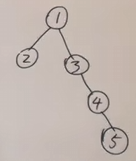
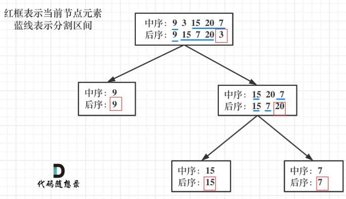

<h1 style="text-align: center; font-weight: bold;">Day 14</h1>

---

## 14. 找树左下角的值

本题递归偏难，反而迭代简单属于模板题， 两种方法掌握一下

题目链接：https://leetcode.cn/problems/find-bottom-left-tree-value

文章讲解：https://programmercarl.com/0513.%E6%89%BE%E6%A0%91%E5%B7%A6%E4%B8%8B%E8%A7%92%E7%9A%84%E5%80%BC.html

视频讲解：https://www.bilibili.com/video/BV1424y1Z7pn

### 思路分析

易错点：需要注意审题，两个条件，<span style = "color:red;font-weight:bold">最底层、最左边</span>，意味着不只是左孩子，<span style = "color:red;font-weight:bold">右孩子也可能符合条件</span>

<div style="width: 200px; margin: 0 auto;">
  
</div>

遍历顺序：前中后三者都可，此题对遍历顺序中的根节点无需处理，只要确保遍历顺序是<span style = "color:red;font-weight:bold">优先遍历左子树，然后遍历右子树</span>即可

### 递归法

```java
class Solution {
    private int Deep = -1;
    private int value = 0;

    public int findBottomLeftValue(TreeNode root) {
        value = root.val;
        findLeftValue(root, 0);
        return value;
    }

    private void findLeftValue(TreeNode root, int deep) {
        if (root == null) {
            return;
        }
        // 判断叶子节点
        if (root.left == null && root.right == null) {
            if (deep > Deep) {
                value = root.val;
                Deep = deep;
            }
        }
        // 递归遍历左子树
        if (root.left != null) {
            deep++;
            findLeftValue(root.left, deep);
            deep--; // 体现回溯的过程
        }
        // 递归遍历右子树
        if (root.right != null) {
            deep++;
            findLeftValue(root.right, deep);
            deep--; // 体现回溯的过程
        }
    }
}
```

### 层序遍历

<span style = "color:red;font-weight:bold">每一层的第一个节点一定是最左节点</span>，当循环结束时正好是遍历到最后一层，使用层序遍历逻辑相对容易理解

```java
class Solution {
    public int findBottomLeftValue(TreeNode root) {
        Queue<TreeNode> queue = new LinkedList<>();
        queue.offer(root);
        int res = 0;
        while (!queue.isEmpty()) {
            int size = queue.size();
            for (int i = 0; i < size; i++) {
                TreeNode poll = queue.poll();
                if (i == 0) {
                    res = poll.val;
                }
                if (poll.left != null) {
                    queue.offer(poll.left);
                }
                if (poll.right != null) {
                    queue.offer(poll.right);
                }
            }
        }
        return res;
    }
}
```

## 112. 路径总和

本题 又一次涉及到回溯的过程，而且回溯的过程隐藏的还挺深，建议先看视频来理解

题目连接：https://leetcode.cn/problems/path-sum

文章讲解：https://programmercarl.com/0112.%E8%B7%AF%E5%BE%84%E6%80%BB%E5%92%8C.html

视频讲解：https://www.bilibili.com/video/BV19t4y1L7CR

### 思路分析

本题无需处理中间节点，前中后三种遍历顺序都可以，**只要找到一条路径就结束**，这里需要把每一个节点的处理结果返回给上一层节点，判断当前遍历的路径是否是符合条件的路径

### 题解

```java
class Solution {
    public boolean hasPathSum(TreeNode root, int targetSum) {
        if (root == null) {
            return false;
        }
        targetSum -= root.val;
        // 叶子结点
        if (root.left == null && root.right == null) {
            return targetSum == 0;
        }
        if (root.left != null) {
            boolean left = hasPathSum(root.left, targetSum);
            if (left) {      // 已经找到，提前返回
                return true;
            }
        }
        if (root.right != null) {
            boolean right = hasPathSum(root.right, targetSum);
            if (right) {     // 已经找到，提前返回
                return true;
            }
        }
        return false;
    }
}
```

## 113. 路径总和 ii

题目链接：https://leetcode.cn/problems/path-sum-ii

### 思路分析

本题是上一题的扩展，区别在于本题需要**记录符合条件的路径**

### 题解

```java
class Solution {
    public List<List<Integer>> pathSum(TreeNode root, int targetSum) {
        List<List<Integer>> res = new ArrayList<>();
        if (root == null) return res; // 非空判断

        List<Integer> path = new LinkedList<>();
        preOrderDfs(root, targetSum, res, path);
        return res;
    }

    public void preOrderDfs(TreeNode root, int targetSum, List<List<Integer>> res, List<Integer> path) {
        path.add(root.val);
        // 遇到了叶子节点
        if (root.left == null && root.right == null) {
            // 找到了和为 targetsum 的路径
            if (targetSum - root.val == 0) {
                res.add(new ArrayList<>(path));
            }
            return; // 如果和不为 targetsum，返回
        }

        if (root.left != null) {
            preOrderDfs(root.left, targetSum - root.val, res, path);
            path.remove(path.size() - 1); // 回溯
        }
        if (root.right != null) {
            preOrderDfs(root.right, targetSum - root.val, res, path);
            path.remove(path.size() - 1); // 回溯
        }
    }
}
```

## 106.从中序与后序遍历序列构造二叉树

从中序与后序遍历序列构造二叉树

本题算是比较难的二叉树题目了，大家先看视频来理解

题目链接：https://leetcode.cn/problems/construct-binary-tree-from-inorder-and-postorder-traversal

文章讲解：https://programmercarl.com/0106.%E4%BB%8E%E4%B8%AD%E5%BA%8F%E4%B8%8E%E5%90%8E%E5%BA%8F%E9%81%8D%E5%8E%86%E5%BA%8F%E5%88%97%E6%9E%84%E9%80%A0%E4%BA%8C%E5%8F%89%E6%A0%91.html

视频讲解：https://www.bilibili.com/video/BV1vW4y1i7dn

### 思路分析



- **第一步：如果数组大小为零的话，说明是空节点了**

- **第二步：如果不为空，那么取后序数组最后一个元素作为节点元素**

- **第三步：找到后序数组最后一个元素在中序数组的位置，作为切割点**

- **第四步：切割<span style = "color:red;font-weight:bold">中序</span>数组，切成中序左数组和中序右数组 （顺序别搞反了，<span style = "color:red;font-weight:bold">一定是先切中序数组</span>）**

- **第五步：切割<span style = "color:red;font-weight:bold">后序</span>数组，切成后序左数组和后序右数组**

- **第六步：递归处理左区间和右区间**

### 常规思路

```java
class Solution {
    /*
         postorder：后序遍历
         inorder：中序遍历
     */
    public TreeNode buildTree(int[] inorder, int[] postorder) {
        if (postorder.length == 0 || inorder.length == 0)
            return null;
        return buildHelper(inorder, 0, inorder.length, postorder, 0, postorder.length);

    }

    private TreeNode buildHelper(int[] inorder, int inorderStart, int inorderEnd, int[] postorder, int postorderStart, int postorderEnd) {
        if (postorderStart == postorderEnd)
            return null;
        // 后序遍历：左右根，最后一定是根节点
        int rootVal = postorder[postorderEnd - 1];
        // 构造节点
        TreeNode root = new TreeNode(rootVal);
        // 后序数组中找到了根节点，在中序数组中找到根节点的位置，进行切割
        int middleIndex;
        for (middleIndex = inorderStart; middleIndex < inorderEnd; middleIndex++) {
            if (inorder[middleIndex] == rootVal)
                break;
        }

        // 中序数组中根节点的左子树索引范围
        int leftInorderStart = inorderStart;
        int leftInorderEnd = middleIndex;

        // 中序数组中根节点的右子树索引范围
        int rightInorderStart = middleIndex + 1;
        int rightInorderEnd = inorderEnd;

        // 依据后序数组中根节点在中序数组中分割出左右子树

        // 在后序数组中分割出左子树
        /*
            后序遍历顺序：左右根
            后序数组的左子树
                起始位置：后序数组的起始位置
                终止位置：根据中序数组中根节点的位置来计算左子树的的节点个数，得到终止位置的索引
         */
        int leftPostorderStart = postorderStart;
        int leftPostorderEnd = postorderStart + (middleIndex - inorderStart);

        // 在后序数组中分割出右子树
        /*
            后序数组中计算出左子树的基础上，除了最后一个位置是根节点，剩余部分就是右子树的索引部分
         */
        int rightPostorderStart = leftPostorderEnd;
        int rightPostorderEnd = postorderEnd - 1;

        // 递归创建左右子树
        root.left = buildHelper(inorder, leftInorderStart, leftInorderEnd, postorder, leftPostorderStart, leftPostorderEnd);
        root.right = buildHelper(inorder, rightInorderStart, rightInorderEnd, postorder, rightPostorderStart, rightPostorderEnd);

        // 返回根节点
        return root;
    }

}
```

### map 优化

```java
class Solution {
    Map<Integer, Integer> map;  // 方便根据数值查找位置
    public TreeNode buildTree(int[] inorder, int[] postorder) {
        map = new HashMap<>();
        for (int i = 0; i < inorder.length; i++) { // 用map保存中序序列的数值对应位置
            map.put(inorder[i], i);
        }

        return findNode(inorder,  0, inorder.length, postorder,0, postorder.length);  // 前闭后开
    }

    public TreeNode findNode(int[] inorder, int inBegin, int inEnd, int[] postorder, int postBegin, int postEnd) {
        // 参数里的范围都是前闭后开
        if (inBegin >= inEnd || postBegin >= postEnd) {  // 不满足左闭右开，说明没有元素，返回空树
            return null;
        }
        int rootIndex = map.get(postorder[postEnd - 1]);  // 找到后序遍历的最后一个元素在中序遍历中的位置
        TreeNode root = new TreeNode(inorder[rootIndex]);  // 构造结点
        int lenOfLeft = rootIndex - inBegin;  // 保存中序左子树个数，用来确定后序数列的个数
        root.left = findNode(inorder, inBegin, rootIndex,
                            postorder, postBegin, postBegin + lenOfLeft);
        root.right = findNode(inorder, rootIndex + 1, inEnd,
                            postorder, postBegin + lenOfLeft, postEnd - 1);

        return root;
    }
}
```

## 105.从前序与中序遍历序列构造二叉树

题目链接：https://leetcode.cn/problems/construct-binary-tree-from-preorder-and-inorder-traversal

### 思路分析

本质是一样的，只不过是从后序变成了前序

### 常规思路

```java
class Solution {
    /*
         preorder：前序遍历
         inorder：中序遍历
     */
    public TreeNode buildTree(int[] preorder, int[] inorder) {
        if (preorder.length == 0 || inorder.length == 0)
            return null;
        return buildHelper(inorder, 0, inorder.length, preorder, 0, preorder.length);
    }

    private TreeNode buildHelper(int[] inorder, int inorderStart, int inorderEnd, int[] preorder, int preorderStart, int preorderEnd) {
        if (preorderStart == preorderEnd || inorderStart == inorderEnd)
            return null;

        // 前序遍历：根左右，第一个元素一定是根节点
        int rootVal = preorder[preorderStart];
        // 构造节点
        TreeNode root = new TreeNode(rootVal);

        // 在中序数组中找到根节点的位置，来划分左右子树
        int middleIndex = inorderStart;
        while (inorder[middleIndex] != rootVal) {
            middleIndex++;
        }

        // 中序数组中根节点的左子树索引范围
        int leftInorderStart = inorderStart;
        int leftInorderEnd = middleIndex;

        // 中序数组中根节点的右子树索引范围
        int rightInorderStart = middleIndex + 1;
        int rightInorderEnd = inorderEnd;

        // 前序数组中，根节点之后是左子树，左子树的节点数为 middleIndex - inorderStart
        int leftPreorderStart = preorderStart + 1;
        int leftPreorderEnd = leftPreorderStart + (middleIndex - inorderStart);

        // 右子树从左子树结束后的位置开始
        int rightPreorderStart = leftPreorderEnd;
        int rightPreorderEnd = preorderEnd;

        // 递归构建左右子树
        root.left = buildHelper(inorder, leftInorderStart, leftInorderEnd, preorder, leftPreorderStart, leftPreorderEnd);
        root.right = buildHelper(inorder, rightInorderStart, rightInorderEnd, preorder, rightPreorderStart, rightPreorderEnd);

        // 返回根节点
        return root;
    }
}
```

### map 优化

```java
class Solution {
    Map<Integer, Integer> map;
    public TreeNode buildTree(int[] preorder, int[] inorder) {
        map = new HashMap<>();
        for (int i = 0; i < inorder.length; i++) { // 用map保存中序序列的数值对应位置
            map.put(inorder[i], i);
        }

        return findNode(preorder, 0, preorder.length, inorder,  0, inorder.length);  // 前闭后开
    }

    public TreeNode findNode(int[] preorder, int preBegin, int preEnd, int[] inorder, int inBegin, int inEnd) {
        // 参数里的范围都是前闭后开
        if (preBegin >= preEnd || inBegin >= inEnd) {  // 不满足左闭右开，说明没有元素，返回空树
            return null;
        }
        int rootIndex = map.get(preorder[preBegin]);  // 找到前序遍历的第一个元素在中序遍历中的位置
        TreeNode root = new TreeNode(inorder[rootIndex]);  // 构造结点
        int lenOfLeft = rootIndex - inBegin;  // 保存中序左子树个数，用来确定前序数列的个数
        root.left = findNode(preorder, preBegin + 1, preBegin + lenOfLeft + 1,
                            inorder, inBegin, rootIndex);
        root.right = findNode(preorder, preBegin + lenOfLeft + 1, preEnd,
                            inorder, rootIndex + 1, inEnd);

        return root;
    }
}
```

## ⭐ 前序和后序能否构造二叉树？

#### 前序和后序不能唯一确定一棵二叉树，因为没有中序遍历无法确定左右部分，也就是无法分割

<image src="https://file1.kamacoder.com/i/algo/20210203154720326.png" />

#### tree1 的前序遍历是[1 2 3]， 后序遍历是[3 2 1]。

#### tree2 的前序遍历是[1 2 3]， 后序遍历是[3 2 1]。

#### 那么 tree1 和 tree2 的前序和后序完全相同，这是一棵树么，很明显是两棵树！

#### 所以前序和后序不能唯一确定一棵二叉树！
