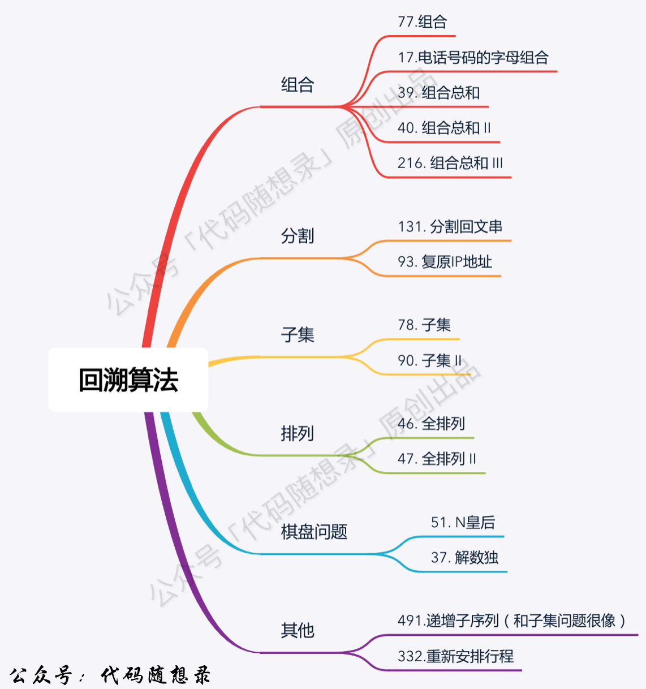

<h1 style="text-align: center; font-weight: bold;">Day 22</h1>

---

## 491.递增子序列

本题和大家刚做过的 90.子集 II 非常像，但又很不一样，很容易掉坑里。

题目链接：https://leetcode.cn/problems/non-decreasing-subsequences/description/

文章讲解：https://programmercarl.com/0491.%E9%80%92%E5%A2%9E%E5%AD%90%E5%BA%8F%E5%88%97.html

视频讲解：https://www.bilibili.com/video/BV1EG4y1h78v

### 思路分析

#### （1）由于本题的题意是<span style="color:red">不能对数组进行排序</span>的，无法使用之前的去重逻辑

#### （2）因此在去重逻辑上有些变化，采用 hashSet 实现去重

#### 注意点

> #### （1）本题要求结果集至少为两个元素
>
> #### （2）同时要求是递增子序列，即下一次取的数必须大于结果集最后一个元素


### 题解

```java
class Solution {
    List<List<Integer>> result = new ArrayList<>();
    List<Integer> path = new ArrayList<>();

    public List<List<Integer>> findSubsequences(int[] nums) {
        backtracking(nums, 0);
        return result;
    }

    public void backtracking(int[] nums, int startIndex) {
        // 本题还是子集问题，不需要剪枝

        /// 题目要求结果集至少两个元素
        if (path.size() >= 2) {
            result.add(new ArrayList<>(path));
        }

        // 由于本题不能对数组排序，去重方式变化，采用 hashset 来记录是否重复
        HashSet<Integer> hashSet = new HashSet<>();

        for (int i = startIndex; i < nums.length; i++) {
            /*
                去重逻辑
                （1）树层上不能重复取元素
                （2）树枝上取的元素要比最后一个元素大（因为要求的是递增子序列）
                （3）比较时需要取数，为了防止异常需要判断是否为空
             */
            if (!path.isEmpty() && nums[i] < path.get(path.size() - 1) || hashSet.contains(nums[i])) {
                continue;
            }
            // 把遍历的树层元素添加到 hashset 中
            hashSet.add(nums[i]);
            path.add(nums[i]);
            // 递归
            backtracking(nums, i + 1);
            // 回溯
            path.remove(path.size() - 1);
            /*
                每一层递归创建新的 hashset，记录本层递归使用过的元素
                不需要进行回溯操作
             */
        }
    }
}
```

## 46.全排列

本题重点感受一下，排列问题与组合问题、组合总和、子集问题的区别。 **为什么排列问题不用 startIndex**

题目链接：https://leetcode.cn/problems/permutations/

文章讲解：https://programmercarl.com/0046.%E5%85%A8%E6%8E%92%E5%88%97.html

视频讲解：https://www.bilibili.com/video/BV19v4y1S79W

### 思路分析

#### 排列问题和组合问题不同的就是同一个元素<span style="color:red">可以重复</span>选择，因为<span style="color:red">涉及顺序问题</span>，这里使用 <span style="color:red">used[ ] 数组</span>记录元素在每一层递归是否被使用过

> #### <span style="color:red">本题</span>是给出的数组是<span style="color:red">没有重复元素</span>的，递归的深度就是数组元素的个数

#### 注意点

> #### （1）添加结果集的前提条件
>
> #### （2）递归的终止条件
>
> #### （3）如何避免重复选择


### 题解

```java
class Solution {
    List<List<Integer>> result = new ArrayList<>();
    LinkedList<Integer> path = new LinkedList<>();
    boolean[] used;

    public List<List<Integer>> permute(int[] nums) {
        used = new boolean[nums.length];
        permuteHelper(nums);
        return result;
    }

    public void permuteHelper(int[] nums) {
        // 结束条件，结果集元素个数和数组元素个数相同
        if (path.size() == nums.length){
            result.add(new ArrayList<>(path));
            return;
        }
        for (int i = 0; i < nums.length; i++) {
            // 选过了就不再选了
            if (used[i]){
                continue;
            }

            used[i] = true;
            path.add(nums[i]);
            // 递归
            permuteHelper(nums);
            // 回溯
            path.removeLast();
            used[i] =false;
        }
    }
}
```

## 47.全排列 II

本题 就是我们讲过的 40.组合总和 II 去重逻辑 和 46.全排列 的结合，可以先自己做一下，然后重点看一下文章中讲的拓展内容： used[i - 1] == true 也行，used[i - 1] == false 也行

题目链接：https://leetcode.cn/problems/permutations-ii/

文章讲解：https://programmercarl.com/0047.%E5%85%A8%E6%8E%92%E5%88%97II.html

视频讲解：https://www.bilibili.com/video/BV1R84y1i7Tm

### 思路分析

#### （1）去重逻辑和组合大体相同，使用 used[ ] 数组去重，注意需要对数组先进行<span style="color:red">排序</span>，目的是为了<span style="color:red">方便通过相邻的节点来判断是否重复使用了</span>

#### （2）由于排列问题可以重复选取之前的元素，在去重逻辑上有一点区别

#### 拓展点

> #### used[ ] 数组<span style="color:red">可以对树层去重，也可以对树枝去重</span>，即为什么提出 used[i - 1] == true 也行，used[i - 1] == false 也行这个问题，延续之前的逻辑，建议<span style="color:red">采用树层去重，好理解、效率高</span>


### 题解

```java
class Solution {
    //存放结果
    List<List<Integer>> result = new ArrayList<>();
    //暂存结果
    List<Integer> path = new ArrayList<>();

    public List<List<Integer>> permuteUnique(int[] nums) {
        // 初始化 used[] 数组
        boolean[] used = new boolean[nums.length];
        Arrays.fill(used, false);
        // 预先对数组排序，方便通过相邻的节点来判断是否重复使用了
        Arrays.sort(nums);

        backtracking(nums,used);
        return result;
    }

    public void backtracking(int[] nums, boolean[] used) {
        // 递归终止条件
        if (path.size() == nums.length) {
            result.add(new ArrayList<>(path));
            return;
        }

        for (int i = 0; i < nums.length; i++) {
            // 采用 used[] 数组进行树层去重，这里的 false 是上一层递归回溯的结果
            if (i > 0 && nums[i - 1] == nums[i] && used[i - 1] == false) {
                continue;
            }

            // 排列问题中元素可以重复选取，选取了就不再选择
            if (used[i]){
                continue;
            }

            used[i] = true;
            path.add(nums[i]);
            // 递归
            backtracking(nums,used);
            // 回溯
            path.remove(path.size() - 1);
            used[i] = false;

        }
    }
}
```

## 拓展题

下面这三道题都非常难，建议大家一刷的时候 可以适当选择跳过。

因为 一刷 也不求大家能把这么难的问题解决，大家目前能了解一下题目的要求，了解一下解题思路，不求能直接写出代码，先大概熟悉一下这些题，二刷的时候，随着对回溯算法的深入理解，再去解决如下三题。

## 332.重新安排行程（可跳过）

本题很难，一刷的录友刷起来 比较费力，可以留给二刷的时候再去解决。

本题没有录制视频，当初录视频是按照 《代码随想录》出版的目录来的，当时没有这道题所以就没有录制。

题目链接：https://leetcode.cn/problems/reconstruct-itinerary/

文章讲解：https://programmercarl.com/0332.%E9%87%8D%E6%96%B0%E5%AE%89%E6%8E%92%E8%A1%8C%E7%A8%8B.html

## ⭐51. N 皇后（适当跳过）

N 皇后这道题目还是<span style="color:red;font-weight:bold">很经典</span>的，一刷的录友们建议看看视频了解了解大体思路 就可以 （如果没时间本次就直接跳过） ，先有个印象，二刷的时候重点解决。

题目链接：https://leetcode.cn/problems/n-queens/

文章讲解：https://programmercarl.com/0051.N%E7%9A%87%E5%90%8E.html

视频讲解：https://www.bilibili.com/video/BV1Rd4y1c7Bq

### 游戏规则

> #### 在一个棋盘上排放棋子，要求不同的棋子<span style="color:red;font-weight:bold">（1）不能在同一行（2）不能在同一列（3）不能在对角线上相邻（45° 或者 135°）</span>

### 思路分析

> #### 本题代码还是采用回溯思路，只是从遍历一维数组<span style="color:red;font-weight:bold">转到遍历二维数组</span>，再额外补充一个函数判断皇后位置是否合法即可

#### 二维数组中遍历对象的变化

> #### <span style="color:red;font-weight:bold">每一层递归遍历每一行，单层递归中遍历某一行的每一列</span>

#### 温馨提示

> #### 3 x 3 的棋盘是无解的，至少从 4 x 4 的棋盘开始，下图采用 3 x 3 的棋盘目的是为了方便举例


### 题解

```java
class Solution {
    List<List<String>> res = new ArrayList<>();

    public List<List<String>> solveNQueens(int n) {
        // 初始化棋盘
        char[][] chessboard = new char[n][n];
        for (char[] c : chessboard) {
            Arrays.fill(c, '.');
        }
        backtracking(chessboard, n, 0);
        return res;
    }

    // 回溯（递归处理每一行，单层递归处理每一列）
    public void backtracking(char[][] chessboard, int n, int row) {
        // 遍历到叶子节点，收获结果
        if (row == n) {
            // 逐行返回棋盘的内容，添加到一维数组中，把结果加入结果集
            res.add(arrayList(chessboard));
        }
        for (int col = 0; col < n; col++) {
            if (isValid(chessboard, n, row, col)) {
                chessboard[row][col] = 'Q';
                // 下一层递归（在棋盘中表示下一行）
                backtracking(chessboard, n, row + 1);
                // 回溯
                chessboard[row][col] = '.';
            }
        }
    }

    /*
        （1）按理说这里应该返回一个三维数组，每个元素就是一个二维数组，即一个棋盘，对应一种情况
        （2）但是题目返回的是二维数组，即每个元素是一维数组
        （3）需要编写一个方法把二维数组的内容按照每一行的方式存储到一维数组中，并返回
     */
    public List arrayList(char[][] chessboard) {
        List<String> list = new ArrayList<>();
        for (char[] c : chessboard) {
            /*
                （1）把棋盘的每一行数据添加到一维数组中
                （2）copyValueOf：复制 char[] 数组的内容，返回一个字符串
             */
            list.add(String.copyValueOf(c));
        }
        return list;
    }

    // 判断皇后位置是否合法
    public boolean isValid(char[][] chessboard, int n, int row, int col) {

        // 由于是逐层递归放置皇后，即只需要检查当前皇后上方对的位置即可

        // 检查行
        /*
            根据程序运行逻辑，在单层搜索的过程中，每一层递归，
            只会选for循环（也就是同一行）里的一个元素，所以不用去重了
         */

        // 检查列（列固定，遍历行，检查同一列上是否出现多个皇后）
        for (int i = 0; i < row; i++) {
            if (chessboard[i][col] == 'Q') {
                return false;
            }
        }
        // 检查 45 度对角线（从当前位置开始，检查右上方是否有皇后）
        for (int i = row - 1, j = col + 1; i >= 0 && j <= n - 1; i--, j++) {
            if (chessboard[i][j] == 'Q') {
                return false;
            }
        }
        // 检查 135 度对角线（从当前位置开始，检查左上方是否有皇后）
        for (int i = row - 1, j = col - 1; i >= 0 && j >= 0; i--, j--) {
            if (chessboard[i][j] == 'Q') {
                return false;
            }
        }
        return true;
    }
}
```

## 37.解数独（适当跳过）

同样，一刷的录友们建议看看视频了解了解大体思路（如果没时间本次就直接跳过），先有个印象，二刷的时候重点解决。
。

题目链接：https://leetcode.cn/problems/sudoku-solver/description/

文章讲解：https://programmercarl.com/0037.%E8%A7%A3%E6%95%B0%E7%8B%AC.html

视频讲解：https://www.bilibili.com/video/BV1TW4y1471V

## 回溯算法总结

刷了这么多回溯算法的题目，可以做一做总结了！

文章讲解：https://programmercarl.com/%E5%9B%9E%E6%BA%AF%E6%80%BB%E7%BB%93.html


