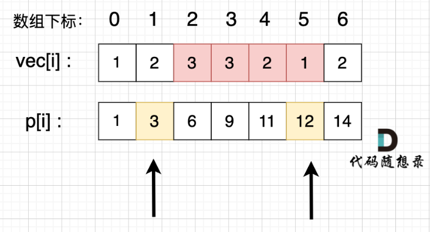
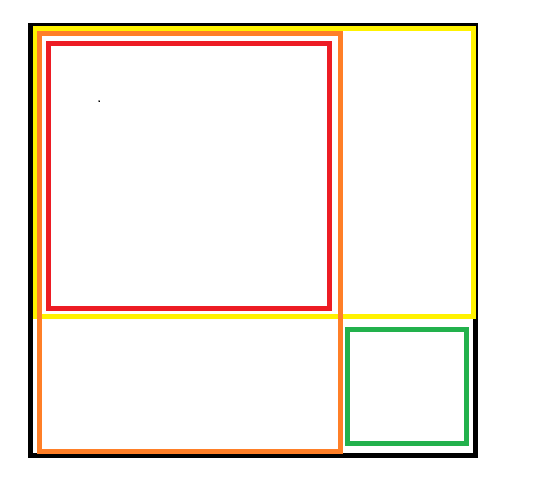

<h1 style="text-align: center; font-weight: bold;">Day 2</h1>

---

## 1. 209.长度最小的子数组

题目建议： 本题关键在于理解<span style= "color:red;font-weight:bold">滑动窗口</span>，拓展题目可以先不做。

题目链接：https://leetcode.cn/problems/minimum-size-subarray-sum/

文章讲解：https://programmercarl.com/0209.%E9%95%BF%E5%BA%A6%E6%9C%80%E5%B0%8F%E7%9A%84%E5%AD%90%E6%95%B0%E7%BB%84.html

视频讲解：https://www.bilibili.com/video/BV1tZ4y1q7XE

### （1）滑动窗口

#### 滑动窗口的<span style= "color:red;font-weight:bold">本质</span>：**双指针**

#### 滑动窗口的<span style= "color:red;font-weight:bold">精髓</span>：**窗口的<span style= "color:red;font-weight:bold">起始位置</span>如何移动**

#### （2）基本介绍

- 窗口就是 满足其和 ≥ s 的长度最小的 连续 子数组。

- 窗口的<span style= "color:red;font-weight:bold">起始位置</span>如何移动：如果当前窗口的值大于等于 s 了，窗口就要向前移动了（也就是该缩小了）。

- 窗口的<span style= "color:red;font-weight:bold">结束位置</span>如何移动：窗口的结束位置就是遍历数组的指针，也就是 for 循环里的索引。

```java
public class Solution {
    // 滑动窗口（双指针）
    public int minSubArrayLen(int target, int[] nums) {
        int i = 0;
        int sum = 0;
        int min_length = Integer.MAX_VALUE;
        for (int j = 0; j < nums.length; j++) {
            // 计算和
            sum += nums[j];
            // 在滑动过程中持续判断
            while (sum >= target) {
                min_length = Math.min(min_length, j - i + 1); // 取最小长度
                sum -= nums[i]; // 头指针前移一位，区间和需要减去头指针指向的值
                i++;
            }
        }
        return min_length == Integer.MAX_VALUE ? 0 : min_length;
    }
}
```

#### 代码分析

- 首先通过循环，让位置开始移动，依次遍历找到符合条件的窗口长度
- 如果找到了符合条件的长度
  - 首先记录当前窗口的长度：**j - i + 1**
  - 通过函数找到窗口的最小长度，在后续循环中**不断更新**（**使用 while 循环**）
  - **让头指针前移一位，同时更新窗口的和**（<span style= "color:red;font-weight:bold">容易遗漏</span>）
- **注意**：在题目中要求（**如果不存在符合条件的子数组，返回 0** ），最后返回值的处理需要注意

### （3）补充题目

- [904.水果成篮](https://leetcode.cn/problems/fruit-into-baskets/)
- [76. 最小覆盖子串](https://leetcode.cn/problems/minimum-window-substring/description/)

## 2. 59.螺旋矩阵 II

题目建议： 本题关键还是在转圈的逻辑

题目链接：https://leetcode.cn/problems/spiral-matrix-ii/

文章讲解：https://programmercarl.com/0059.%E8%9E%BA%E6%97%8B%E7%9F%A9%E9%98%B5II.html

视频讲解：https://www.bilibili.com/video/BV1SL4y1N7mV/

### （1）思路分析

本题的**关键**：遍历的区间长度如何选择？

这里采用二分法中**左闭右开**的思路，<span style= "color:red;font-weight:bold">最后一个点由下一次遍历处理</span>

#### 解题步骤

- 首先通过模拟，实现四个方向的模拟，同时在矩阵中填入数据
- 圈数
  - 关系-->**圈数 = n / 2**
  - **偶数圈**：圈数刚好是整数，模拟完四个方向即可
  - **奇数圈**：单独处理最后一个点

**关键点：理解遍历终点的位置和边界的关系**

### （2）题解

```java
public class Solution {
    public int[][] generateMatrix(int n) {

        // 核心思想在左闭右开，该条边的最后一个点由下一条边处理

        int[][] nums = new int[n][n]; // 矩阵的初始化

        int start_x = 0, start_y = 0; // 每一圈的起点
        int i, j; // i 代表行，j 代表列

        int loop = 1; // 记录圈数
        int count = 1; // 矩阵中填入的数字
        int offset = 1;

        while (loop <= n / 2) {

            // 向右走
            for (j = start_y; j < n - offset; j++) {
                nums[start_x][j] = count;
                count++;
            }

            // 向下走
            for (i = start_x; i < n - offset; i++) {
                nums[i][j] = count;
                count++;
            }

            // 向左走
            for (; j > start_y; j--) {
                nums[i][j] = count;
                count++;
            }

            // 向上走
            for (; i > start_x; i--) {
                nums[i][j] = count;
                count++;
            }

            // 一圈结束后，变化起始坐标
            start_x++;
            start_y++;

            offset++; // 往里走了一圈，终点位置往里缩小，差值增大
            loop++; // 圈数自增一
        }

        //  处理奇数圈最后一个点
        if(n % 2 == 1){
            nums[start_x][start_y] = count;
        }
        return nums;
    }
}
```

##### 代码分析

- 定义好变量，通过 offset 来控制遍历的终点
- 每一圈结束后，进入内圈
  - 起始点坐标变化
  - 终点位置减小，offset 值需要自增
  - 圈数自增
- 根据思路，模拟四个方向的遍历，最后再单独处理奇数圈中的最后一个点

## 3. 区间和

题目建议：掌握<span style= "color:red;font-weight:bold">前缀和</span>思想

文章讲解：https://www.programmercarl.com/kamacoder/0058.%E5%8C%BA%E9%97%B4%E5%92%8C.html

### （1）一维前缀和介绍

1. 场景引出：给定一个一维数组，给出任意区间，要求求改区间的和

2. 常规思路：使用循环遍历，对该区间求和即可

3. **常规思路带来的问题是什么？**

如果查询 m 次，每次查询的范围都是从 0 到 n - 1，那么该算法的时间复杂度是 O(n \* m) m 是查询的次数，如果查询次数非常大的话，这个时间复杂度也是非常大的。

4. **前缀和的<span style= "color:red;font-weight:bold">优点</span>：前缀和的思想是重复利用计算过的子数组之和，从而降低区间查询需要累加计算的次数**

5. 前缀和方法介绍

- **原始数组 vec[]**
- **前缀和数组 p[]**：记录从 vec[0]--->vec[i]的和
- **区间[a,b]的和：**<span style= "color:red;font-weight:bold">sum[a,b] = p[b] - p[a - 1]</span>

#### 图解分析



### （2）题解

```java
import java.util.Scanner;

public class Main {
    public static void main(String[] args) {
        Scanner scanner = new Scanner(System.in);

        int n = scanner.nextInt();
        int vec[] = new int[n];
        int[] p = new int[n]; // 前缀和数组

        int presum = 0;
        for (int i = 0; i < n; i++) {
            vec[i] = scanner.nextInt();
            presum += vec[i];
            p[i] = presum; // 初始化前缀和数组
        }

        // 循环读取整数，每一轮读取两个，表示区间和的范围
        while(scanner.hasNextInt()){
            int a = scanner.nextInt();
            int b = scanner.nextInt();

            int sum;
            if(a==0){  // 判断左端点是为 0
                sum = p[b];
            }else{
                sum = p[b] - p[a - 1];
            }
            System.out.println(sum);
        }
        scanner.close();
    }
}

```

#### 代码分析

- 前缀和数组的初始化：初始化原始数组的同时计算前缀和
- 判断前缀和的左区间是否为 0
  - 左区间为 0：前缀和 = p[b]的值
  - 左区间不为 0：前缀和 = <span style= "color:red;font-weight:bold">p[b] - p[a - 1]</span>（不理解可以看前面的图解）

**补充**：循环条件 **scanner.hasNextInt()** 表示的**循环读入整数**，在每一轮循环中读入两个整数

## 4. 开发商购买土地

题目建议：本题是一维前缀和的应用，知识点延伸：<span style= "color:red;font-weight:bold">二维前缀和</span>

https://www.programmercarl.com/kamacoder/0044.%E5%BC%80%E5%8F%91%E5%95%86%E8%B4%AD%E4%B9%B0%E5%9C%9F%E5%9C%B0.html

### （1）一维前缀和应用

#### 思路分析

- 如果使用循环暴力破解，时间复杂度会很大，不推荐
- 由于题目要求求的是总和，这里可以采用一位前缀和的思想，对每一行，每一列求和，在后续中直接查找前缀和求差值即可

```java
import java.util.Scanner;

public class Main {
    public static void main(String[] args) {
        Scanner scanner = new Scanner(System.in);
        int n = scanner.nextInt();
        int m = scanner.nextInt();
        int sum = 0; // 统计总和
        int[][] vec = new int[n][m];
        for (int i = 0; i < n; i++) {
            for (int j = 0; j < m; j++) {
                vec[i][j] = scanner.nextInt();
                sum += vec[i][j];
            }
        }

        // 统计横向和
        int[] horizontal = new int[n];
        for (int i = 0; i < n; i++) {
            for (int j = 0; j < m; j++) {
                horizontal[i] += vec[i][j];
            }
        }

        // 统计纵向和
        int[] vertical = new int[m];
        for (int j = 0; j < m; j++) {
            for (int i = 0; i < n; i++) {
                vertical[j] += vec[i][j];
            }
        }

        int result = Integer.MAX_VALUE;

        // 横向切割，找出最小的总和差值
        int horizontalCut = 0;
        for (int i = 0; i < n; i++) {
            horizontalCut += horizontal[i]; // 取前缀和
            // 利用总和求另一部分的和
            result = Math.min(result,Math.abs((sum - horizontalCut) - horizontalCut));
        }

        // 纵向切割，找出最小的总和差值
        int verticalCut = 0;
        for (int j = 0; j < m; j++) {
            verticalCut += vertical[j];
            // 利用总和求另一部分的和
            result = Math.min(result,Math.abs((sum - verticalCut) - verticalCut));
        }

        System.out.println(result);
        scanner.close();
    }
}

```

#### 代码分析

- 首先初始化二维矩阵，并求出矩阵的和（在后续可以使用差值计算另一半矩阵的和）
- 之后通过横向和纵向切分，分别计算每一行和每一列的前缀和，保存到数组中
- 使用循环对行和列切割，使用函数依次计算最小的差值，并在下一次循环中更新
- 输出最小的差值，关闭 scanner，避免资源的浪费

### （2）二维前缀和

教学视频分享：https://www.bilibili.com/video/BV1TD421g78b/?spm_id_from=333.337.search-card.all.click&vd_source=822e86b53dab98632ef279a46d2536db

本题是在一维前缀和的视角下解决的。但是题目本身是二维矩阵特点，我们可以引出二维前缀和

#### 1. 基本介绍



矩形的说明

- 我们将一个矩形划分成了不同的区域
  - 整个矩形：黑色方框
  - 左边的矩形：橙色方框
  - 上面的矩形：黄色方框
  - 左上角的矩形：红色方框
  - 右下角的矩形：绿色方框
- **关系：整个矩形（黑色方框） =** <span style= "color:red;font-weight:bold">橙色区域 + 黄色区域 - 红色区域 + 蓝色区域</span>

#### 2. 定义

说明：二维矩阵的起始坐标为（1，1），不采用（0，0），目的是为了方便处理

二维前缀和中，s[i][j] 表示以 <span style= "color:red;font-weight:bold">s[1][1]为左上角顶点，s[i][j]为右下角顶点，两个顶点作为对角线构成的矩形中元素的和</span>

#### 3. 推导图解矩形的公式（二维前缀和的<span style= "color:red;font-weight:bold">构建</span>）

1. 首先明确 sum [i][j]的定义，根据各部分矩形的和可以得到如下公式

2. **公式：sum [i][j]=sum [i-1][j]+sum [i][j-1]-sum [i-1][j-1]+a [i][j]**

- sum [i][j]：黑色方框
- sum [i-1][j]：黄色方框
- sum [i][j-1]：橙色方框
- sum [i-1][j-1]：红色方框（黄色方框和橙色方框重叠的部分，需要减掉）
- a [i][j]：绿色方框

3. 推导绿色方框：**a [i][j] = sum [i][j] - sum [i-1][j] - sum [i][j-1] + sum [i-1][j-1]**

对该公式进行抽象：绿色方框看作就是我们任意的子矩阵，该面积可以有上诉公式的来

#### 4. 公式（二维前缀和的<span style= "color:red;font-weight:bold">查询</span>）

公式来由：根据图解矩阵中的公式逆推求解绿色方框的和，通过抽象得到

若以（a，b）为左上角，（c，d）为右下角，则任意子矩阵的和为<span style= "color:red;font-weight:bold">sum[c][d] - sum[a-1][b] - sum[a][b-1] + sum[a-1][b-1]</span>

#### 5. 公式总结

#### （1）<span style= "color:red;font-weight:bold">构建</span>二维前缀和

```java
sum [i][j]=sum [i-1][j]+sum [i][j-1]-sum [i-1][j-1]+a [i][j]
```

#### （2）<span style= "color:red;font-weight:bold">查询</span>二位前缀和

```java
a [i][j] = sum [i][j] - sum [i-1][j] - sum [i][j-1] + sum [i-1][j-1]
```

### （3）二维前缀和应用

#### 注意点：二维矩阵的<span style= "color:red;font-weight:bold">初值为 a[1][1]</span>，不用 0 作为初始值

#### 二维矩阵题解如下

```java


import java.util.Scanner;

public class Main {
    public static void main(String[] args) {
        Scanner scanner = new Scanner(System.in);

        int n = scanner.nextInt();
        int m = scanner.nextInt();

        int[][] s = new int[n + 1][m + 1]; // 前缀和数组

        int result = Integer.MAX_VALUE;

        // 通过二维前缀和的定义，构建前缀和
        for (int i = 1; i <= n; i++) {
            for (int j = 1; j <= m; j++) {
                int x = scanner.nextInt();
                s[i][j] = s[i - 1][j] + s[i][j - 1] - s[i - 1][j - 1] + x;
            }
        }

        // 行切割
        for (int i = 1; i < n; i++) {
            int ans = Math.abs((s[n][m] - s[i][m]) - s[i][m]);
            result = Math.min(result, ans);
        }

        // 列切割
        for (int j = 1; j < m; j++) {
            int ans = Math.abs((s[n][m] - s[n][j]) - s[n][j]);
            result = Math.min(result, ans);
        }

        System.out.println(result);
        scanner.close();
    }
}
```

代码分析

- 通过前面的推导，使用公式构建二维前缀和
- 通过行切割，列切割，计算最小的差值，
- 输出最小的差值，关闭 scanner

## 5. 总结

- 滑动窗口：理解滑动的原理和头指针什么时候移动
- 矩阵的模拟：关键在于边界的处理（**左闭右开**）
- 前缀和
  - 一维前缀和
  - 二维前缀和

---

## <center>阶段一结束：数组小结</center>

### 文章链接

#### https://www.programmercarl.com/%E6%95%B0%E7%BB%84%E6%80%BB%E7%BB%93%E7%AF%87.html#%E6%95%B0%E7%BB%84%E7%9A%84%E7%BB%8F%E5%85%B8%E9%A2%98%E7%9B%AE

### 一、数组理论基础

### 二、二分思想

#### 这是一个模板思想，熟悉查找的原理和过程的分析即可

### 三、双指针

#### 主要是理解双指针的应用场景和实现原理

#### 1. 快慢双指针

#### 2. 对撞指针

#### 3. 滑动窗口

#### 应用场景：求解子序列问题

#### （1）精髓就在于头指针什么时候移动

#### （2）头指针移动后记得缩小区间和

#### 四、二分区间思想的矩阵模拟

### 五、前缀和

#### 应用场景：求解区间和

#### 重点理解前缀和的思想和实现方法，一维和二维的使用场景

#### （1）一维前缀和

#### （2）二维前缀和
