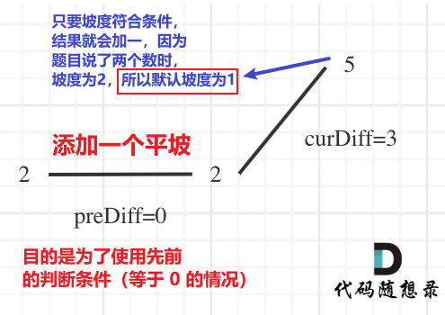

<h1 style="text-align: center; font-weight: bold;">Day 23</h1>

---

贪心算法其实就是没有什么规律可言，所以大家了解贪心算法就了解它没有规律的本质就够了

**不用花心思去研究其规律**， 没有思路就立刻看题解

基本贪心的题目 有两个极端，**要不就是特简单，要不就是死活想不出来**

学完贪心之后再去看动态规划，就会了解贪心和动规的区别

## 理论基础

文章讲解：https://programmercarl.com/%E8%B4%AA%E5%BF%83%E7%AE%97%E6%B3%95%E7%90%86%E8%AE%BA%E5%9F%BA%E7%A1%80.html

视频讲解：https://www.bilibili.com/video/BV1WK4y1R71x/?vd_source=822e86b53dab98632ef279a46d2536db

### 什么是贪心

> #### 例如，有一堆钞票，你可以拿走十张，如果想达到最大的金额，你要怎么拿？
>
> #### 指定每次拿最大的，最终结果就是拿走最大数额的钱。
>
> #### 每次拿最大的就是局部最优，最后拿走最大数额的钱就是推出全局最优。

### 贪心的本质

> #### （1）贪心的<span style="color:red">本质</span>是选择每一阶段的<span style="color:red">局部最优</span>，从而达到<span style="color:red">全局最优</span>
>
> #### （2）贪心算法，<span style="color:red">没有套路 ❗❗❗</span>

### 解题步骤

#### （1）将问题分解为若干个子问题

#### （2）找出适合的贪心策略

#### （3）求解每一个子问题的最优解

#### （4）将局部最优解堆叠成全局最优解

> #### 这个四步其实过于理论化了，我们平时在做贪心类的题目时，如果按照这四步去思考，真是有点“鸡肋”。
>
> #### 做题的时候，只要想清楚<span style="color:red">局部最优是什么</span>，如果<span style="color:red">推导出全局最优</span>，其实就够了

## 455.分发饼干

题目链接：https://leetcode.cn/problems/assign-cookies

文章讲解：https://programmercarl.com/0455.%E5%88%86%E5%8F%91%E9%A5%BC%E5%B9%B2.html

视频讲解：https://www.bilibili.com/video/BV1MM411b7cq

### 思路分析

#### （1）大尺寸的饼干既可以满足胃口大的孩子也可以满足胃口小的孩子，那么就应该优先满足胃口大的。

#### （2）这里的<span style="color:red">局部最优</span>就是<span style="color:red">大饼干喂给胃口大的</span>，充分利用饼干尺寸喂饱一个，<span style="color:red">全局最优</span>就是喂饱尽可能多的小孩。

#### （3）为了更好对应大饼干喂给胃口大的小孩，<span style="color:red">先对数组排序</span>，从数组的<span style="color:red">末尾开始遍历</span>，外层循环遍历小孩，内层循环遍历饼干（只有满足条件才继续遍历，使用 while 循环来控制条件）

### 题解

```java
class Solution {
    public int findContentChildren(int[] g, int[] s) {
        // 避免饼干浪费，大饼干先喂饱大胃口
        Arrays.sort(g);
        Arrays.sort(s);
        int count = 0;
        int start = s.length - 1;
        // 遍历胃口
        for (int index = g.length - 1; index >= 0; index--) {
            if(start >= 0 && g[index] <= s[start]) {
                start--;
                count++;
            }
        }
        return count;
    }
}
```

## 376. 摆动序列 ⚠️

题目链接：https://leetcode.cn/problems/wiggle-subsequence

文章讲解：https://programmercarl.com/0376.%E6%91%86%E5%8A%A8%E5%BA%8F%E5%88%97.html

视频讲解：https://www.bilibili.com/video/BV17M411b7NS

### 思路分析

#### 使用 prediff 和 curdiff 来记录当前数与其前后数的差值，根据差值是否是一正一负来判断是否符合摆动序列的条件


> #### 局部最优：<span style="color:red">删除单调坡度上的节点</span>（不包括单调坡度两端的节点），那么这个坡度就可以有两个局部峰值
>
> #### 整体最优：整个序列有最多的局部峰值，从而达到最长摆动序列
>
> #### 符合摆动的条件：(preDiff < 0 && curDiff > 0) || (preDiff > 0 && curDiff < 0)

### 上下坡有平坡


> #### 这种情况中，我们需要删除平坡中重复的元素，<span style="color:red">保留最后一个元素即可</span>，即：prediff = 0 && curdiff < 0
>
> #### 结合之前摆动的条件，结合起来可以得到如下摆动条件：
>
> #### (preDiff <= 0 && curDiff > 0) || (preDiff >= 0 && curDiff < 0)

### 数组首尾两端



> #### <span style="color:red">初始化 result = 1</span>
>
> #### 具体解释
>
> #### （1）为了使用先前(preDiff <= 0 && curDiff > 0) || (preDiff >= 0 && curDiff < 0)这个条件，必须需要有三个数，这里自己添加一个平坡，结果刚好满足条件 preDiff = 0
>
> #### （2）使用以上条件的逻辑是，只要满足条件，结果集就会自增一
>
> #### （3）但是题目说了，当只有两个元素的时候，结果为 2，为了使得满足条件后自增一（计算了左边的峰值）的结果等于 2，所以这里初始化时，默认右边的坡度为 1，即 result = 1（<span style="color:red">默认最右端有一个峰值</span>），遍历元素时，<span style="color:red">只遍历到倒数第二个元素</span>即可

### 单调坡度有平坡


> #### （1）prediff 和 curdiff 是在遍历过程中逐渐变化的，且 prediff 在 curdiff 之前，在这种情况中，何时更新 prediff 就决定了结果集是否正确的问题
>
> #### （2）单调中的平坡不能算峰值（即摆动），如果结果集错误（prediff 时时跟着 curdiff 的变化而变化），即多计算了平坡中最后那个一元素
>
> #### （3）上图情况中，实际上只有两个摆动，第一个元素和最后一个元素（对应数组首尾两端这种情况）
>
> #### （3）解决方案：<span style="color:red">只有当满足条件时，才更新 prediff 的位置</span>，prediff 只记录当坡度变化的时候，下一个坡的初始坡度，然后 prediff 就不改变了，直到遇到下一个摆动（坡度方向又改变了）再去改变 prediff，这样的好处就是不会记录平坡这种情况

### 题解

```java

```

## 53. 最大子序和

题目链接：https://leetcode.cn/problems/maximum-subarray

文章讲解：https://programmercarl.com/0053.%E6%9C%80%E5%A4%A7%E5%AD%90%E5%BA%8F%E5%92%8C.html

视频讲解：https://www.bilibili.com/video/BV1aY4y1Z7ya

### 思路分析

> #### 局部最优

#### （1）当前<span style="color:red">“连续和”为负数的时候立刻放弃</span>，从下一个元素重新计算“连续和”，因为负数加上下一个元素 “连续和”只会越来越小

#### （2）只要<span style="color:red">连续和</span>还是<span style="color:red">正数</span>就会对后面的元素<span style="color:red">起到增大总和的作用</span>，所以只要连续和为正数我们就保留

#### （3）这相当于是暴力解法中的不断调整最大子序和区间的起始位置

> #### 举例：如果 -2 和 1 在一起，计算起点的时候，一定是从 1 开始计算，因为负数只会拉低总和，这就是贪心贪的地方

### 题解

```java
class Solution {
    public int maxSubArray(int[] nums) {
        if (nums.length == 1) {
            return nums[0];
        }
        // 存放结果，初始化为最小，在遍历过程中不断更新
        int sum = Integer.MIN_VALUE;
        // 用于计算每一次累加的和
        int count = 0;
        for (int i = 0; i < nums.length; i++) {
            count += nums[i];
            // 找到了更大的子序列和
            if (count > sum) {
                sum = count; // 取区间累计的最大值（相当于不断确定最大子序终止位置）
            }
            // 如果发现和更小了，就更新贪心的起点(跳过当前遍历的数)
            if (count < 0) {
                count = 0; // 相当于重置最大子序起始位置，因为遇到负数一定是拉低总和
            }
        }
        return sum;
    }
}
```

### 输出子数组

```java
class Solution {
    public int maxSubArray(int[] nums) {
        if (nums.length == 1) {
            return nums[0];
        }

        int sum = Integer.MIN_VALUE; // 存放最大子数组和
        int count = 0; // 当前子数组的累加和
        int start = 0; // 当前子数组的起始索引
        int end = 0; // 当前子数组的结束索引
        int tempStart = 0; // 临时记录子数组的起始位置

        for (int i = 0; i < nums.length; i++) {
            count += nums[i];

            // 如果找到更大的子数组和
            if (count > sum) {
                sum = count;
                start = tempStart; // 更新最大子数组的起始位置
                end = i; // 更新最大子数组的结束位置
            }

            // 如果当前子数组的和变小，重置子数组的起始位置
            if (count < 0) {
                count = 0;
                tempStart = i + 1; // 从下一个元素重新开始
            }
        }

        // 输出最大子序列
        System.out.print("Max Subarray: ");
        for (int i = start; i <= end; i++) {
            System.out.print(nums[i] + " ");
        }
        System.out.println();

        return sum;
    }

    public static void main(String[] args) {
        Solution solution = new Solution();
        int[] nums = {-2, 1, -3, 4, -1, 2, 1, -5, 4};
        int result = solution.maxSubArray(nums);
        System.out.println("Max Sum: " + result);
    }
}
```
