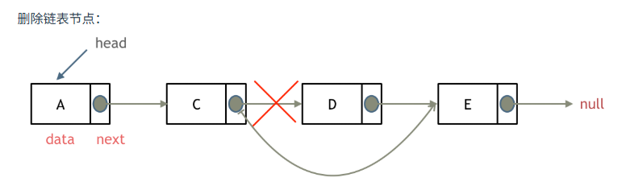
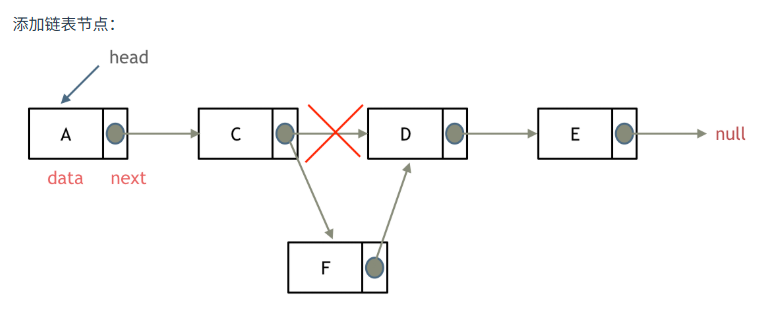
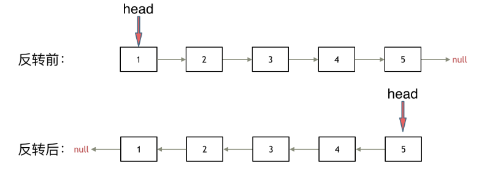

<h1 style="text-align: center; font-weight: bold;">Day 3</h1>

---

## 1. 链表理论基础

建议：了解链表的基本结构，区别链表和数组

文章链接：https://programmercarl.com/%E9%93%BE%E8%A1%A8%E7%90%86%E8%AE%BA%E5%9F%BA%E7%A1%80.html

## ⭐ 虚拟头节点思想

#### 1. 问题的引出

#### 在传统链表中，头指针执行头节点，即是链表的第一个元素，当涉及对头节点的操作时就会不方便，这里为了<span style="color:red;font-weight:bold">统一每个节点的操作方法</span>，使用虚拟按头节点

#### 2. 虚拟头节点

#### 变量名：dummy

#### <span style="color:red;font-weight:bold">在链表的头节点前加入一个节点</span>，这样对头节点的操作就能和对其他节点的操作统一

## 2. 203.移除链表元素

建议： 本题最关键是要理解 虚拟头结点的使用技巧，这个对链表题目很重要。

题目链接：https://leetcode.cn/problems/remove-linked-list-elements/

文章链接：https://programmercarl.com/%E9%93%BE%E8%A1%A8%E7%90%86%E8%AE%BA%E5%9F%BA%E7%A1%80.html

视频讲解：https://www.bilibili.com/video/BV18B4y1s7R9

### （1）思路分析

- 在题目中已经指定了头节点。这里使用传统的方法，当然也可以使用虚拟头节点（在对头节点的操作上就很方便）
- 需要删除第 i 个节点，就需要找到第 i 个节点的<span style="color:red;font-weight:bold">前驱</span>，只有通过改变后继指针的指向来实现节点的删除（**注意：C/C++ 需要手动删除节点，Java / Python 有垃圾回收机制，只需要改变指针的指向即可**）
- **易错点**：<span style="color:red;font-weight:bold">需要考虑头节点的 val 可能是目标元素</span>，即需要对头节点操作



### （2）传统解法

```java
public class Solution {
    public ListNode removeElements(ListNode head, int val) {
        // head.val = val
        while (head != null && head.val == val) {
            head = head.next;
        }

        // head.next != val
        ListNode p;
        p = head;
        while (p != null && p.next != null) {
            if (p.next.val == val) {
                p.next = p.next.next;
            } else {
                p = p.next;
            }
        }
        return head;
    }
}


class ListNode {
    int val;
    ListNode next;

    ListNode() {
    }

    ListNode(int val) {
        this.val = val;
    }

    ListNode(int val, ListNode next) {
        this.val = val;
        this.next = next;
    }
}

```

代码分析

- 使用循环操作实现元素的删除，同时注意头节点的 val 也可能是目标值
- 如果是 C\C++ 需要手动删除节点（释放内存）

### （3）虚拟头节点

```java
public ListNode removeElements(ListNode head, int val) {
    // 设置一个虚拟的头结点
    ListNode dummy = new ListNode();
    dummy.next = head;

    ListNode cur = dummy;
    while (cur.next != null) {
        if (cur.next.val == val) {
            cur.next = cur.next.next;
        } else {
            cur = cur.next;
        }
    }
    return dummy.next;
}

```

## 3. ⭐707.设计链表

建议： 这是一道考察 链表综合操作的题目，不算容易，可以练一练 使用虚拟头结点

题目链接：https://leetcode.cn/problems/design-linked-list/

文章链接：https://programmercarl.com/0707.%E8%AE%BE%E8%AE%A1%E9%93%BE%E8%A1%A8.html

视频讲解：https://www.bilibili.com/video/BV1FU4y1X7WD

### （1）思路分析

为了统一每个节点的操作，这里采用虚拟头节点的处理方法

### （2）相关操作

- get(index)：获取链表中第 index 个节点的值。如果索引无效，则返回-1。
- addAtHead(val)：在链表的第一个元素之前添加一个值为 val 的节点。插入后，新节点将成为链表的第一个节点。
- addAtTail(val)：将值为 val 的节点追加到链表的最后一个元素。
- addAtIndex(index,val)：在链表中的第 index 个节点之前添加值为 val 的节点。如果 index 等于链表的长度，则该节点将附加到链表的末尾。如果 index 大于链表长度，则不会插入节点。如果 index 小于 0，则在头部插入节点。
- deleteAtIndex(index)：如果索引 index 有效，则删除链表中的第 index 个节点。

### （3）注意点

- get(index)
  - 为了方便理解，按题目要求第一个元素的下标是 0，<span style="color:red;font-weight:bold">初始时 cur 指向第一个元素</span>（**cur = head.next**）
  - 右边界是 size - 1 的索引位置，即 index = size 是**不可取**的
- addAtHead(val)：**添加一个节点**，<span style= "color:red; font-weight:bold">先修改后继指针，再修改前驱指针</span>
- addAtTail(val)：由于是在链表的末尾添加节点，即**右边界 index = size 这个条件可取**
- 指定索引**添加或者删除**都是需要找到 index 的前驱节点，使用虚拟头节点，在**初始时 cur = dummy**，<span style="color:red;font-weight:bold">总能保证被操作的元素是 cur->next</span>




### （4）题解

```java
//单链表
class MyLinkedList {
    // 定义节点
    class ListNode {
        int val;
        ListNode next;
        ListNode(int val) {
            this.val=val;
        }
    }
    //size存储链表元素的个数
    private int size;
    //注意这里记录的是虚拟头结点
    private ListNode head;

    //初始化链表
    public MyLinkedList() {
        this.size = 0;
        this.head = new ListNode(0);
    }

    //获取第index个节点的数值，注意index是从0开始的，第0个节点就是虚拟头结点
    public int get(int index) {
        //如果index非法，返回-1
        if (index < 0 || index >= size) {
            return -1;
        }
        ListNode cur = head.next;
        //第0个节点是虚拟头节点，所以查找第 index+1 个节点
        for (int i = 0; i < index; i++) {
            cur = cur.next;
        }
        return cur.val;
    }

    public void addAtHead(int val) {
        ListNode newNode = new ListNode(val);
        newNode.next = head.next;
        head.next = newNode;
        size++;

        // 在链表最前面插入一个节点，等价于在第0个元素前添加
        // addAtIndex(0, val);
    }


    public void addAtTail(int val) {
        ListNode newNode = new ListNode(val);
        ListNode cur = head;
        while (cur.next != null) {
            cur = cur.next;
        }
        cur.next = newNode;
        size++;

        // 在链表的最后插入一个节点，等价于在(末尾+1)个元素前添加
        // addAtIndex(size, val);
    }

    // 在第 index 个节点之前插入一个新节点，例如index为0，那么新插入的节点为链表的新头节点。
    // 如果 index 等于链表的长度，则说明是新插入的节点为链表的尾结点
    // 如果 index 大于链表的长度，则返回空
    public void addAtIndex(int index, int val) {
        if (index < 0 || index > size) {
            return;
        }

        //找到要插入节点的前驱
        ListNode pre = head;
        for (int i = 0; i < index; i++) {
            pre = pre.next;
        }
        ListNode newNode = new ListNode(val);
        newNode.next = pre.next;
        pre.next = newNode;
        size++;
    }

    public void deleteAtIndex(int index) {
        if (index < 0 || index >= size) {
            return;
        }

        //因为有虚拟头节点，所以不用对index=0的情况进行特殊处理
        ListNode pre = head;
        for (int i = 0; i < index ; i++) {
            pre = pre.next;
        }
        pre.next = pre.next.next;
        size--;
    }
}
```

提示：题目中设计了单链表和双链表，这里只以单链表为例

## 4. 206.反转链表

建议：先看视频讲解，视频讲解中对反转链表**需要注意的点**讲的很清晰

题目链接：https://leetcode.cn/problems/reverse-linked-list/

文章链接：https://programmercarl.com/0206.%E7%BF%BB%E8%BD%AC%E9%93%BE%E8%A1%A8.html

视频讲解：https://www.bilibili.com/video/BV1nB4y1i7eL

### （1）思路分析

- 首先就可以使用双指针的思路，在此基础上改进就可以变成递归写法
- **关于翻转**：本质就是改变两个节点间指针的朝向，初始时设置两个指针
  - pre：指向空，即翻转后链表的末尾节点的后继节点
  - cur：指向头节点：即翻转后链表的尾节点
- **关于双指针的移动**
  - **temp**：保存 cur 的后继节点
  - <span style="color:red;font-weight:bold">先移动前 pre，后移动 cur</span>，如果返过来，那 cur 移动之后，pre 就找不到目标节点移动（因为在移动前指针的指向已经完成翻转）
- **关于结束条件**：当 cur 为空的时候循环结束，此时 pre 执行的就是翻转后链表的头节点




### （2）双指针题解

```java
// 双指针
class Solution {
    public ListNode reverseList(ListNode head) {
        ListNode prev = null;
        ListNode cur = head;
        ListNode temp = null;
        while (cur != null) {
            temp = cur.next; // 保存下一个节点
            cur.next = prev; // 翻转链表指针朝向
            prev = cur;
            cur = temp;
        }
        return prev;
    }
}
```

### （3）递归题解

#### 由双指针算法进行改进，pre、cur 指针的移动可以用递归实现

```java
// 递归
class Solution {
    public ListNode reverseList(ListNode head) {
        return reverse(null, head);
    }

    private ListNode reverse(ListNode prev, ListNode cur) {
        if (cur == null) {
            return prev;
        }
        ListNode temp = null;
        temp = cur.next;// 先保存下一个节点
        cur.next = prev;// 反转
        // 更新prev、cur位置
        // prev = cur;
        // cur = temp;
        return reverse(cur, temp);
    }
}
```

## 5. 总结

- 理解<span style="color:red;font-weight:bold">虚拟头节点</span>的思想以及如何运用在链表的操作中
- 掌握链表的基本操作
  - get(index)：获取链表中第 index 个节点的值
  - addAtHead(val)：在链表的第一个元素之前添加一个值为 val 的节点
  - addAtTail(val)：将值为 val 的节点追加到链表的最后一个元素
  - addAtIndex(index,val)：在链表中的第 index 个节点之前添加值为 val 的节点（注意两种极端情况：1. 在头节点前 2. 在链表的末尾）
  - deleteAtIndex(index)：则删除链表中的第 index 个节点。
- 理解链表反转的思想，双指针是如何运用的
